# 🏛️ BLGV Unified Treasury Ecosystem

**The Premier Bitcoin-Native Financial Infrastructure Platform**

[](https://bitcoin.org) [](https://typescriptlang.org) [](https://reactjs.org) [](https://digitalocean.com)

---

## 🎯 **Vision & Mission**

**Vision**: Build the world's premier Bitcoin-native financial ecosystem that bridges institutional finance with the decentralized economy.

**Mission**: Provide transparent, secure, and efficient treasury management solutions while developing the critical infrastructure needed for global Bitcoin adoption.

---

## 🌐 **Ecosystem Overview**

The BLGV ecosystem consists of five integrated platforms that create a comprehensive Bitcoin-native financial infrastructure:

### **Core Platforms**

| Platform | Purpose | Technology | Status |
|----------|---------|------------|--------|
| **🏛️ Treasury Intelligence** | AI-powered treasury analytics & management | React + TypeScript | ✅ Production |
| **⚡ DEX Platform** | Bitcoin-native decentralized exchange | React + Node.js | ✅ Production |
| **⛏️ Mining Pool** | Professional Bitcoin mining operations | Python + Flask | ✅ Production |
| **📱 Mobile App** | Unified mobile experience | React Native + Expo | 🔶 Beta |
| **⚡ Lightning LSP** | Lightning Network service provider | TypeScript + LND | 🚀 Development |

### **Supporting Infrastructure**

| Component | Purpose | Technology | Status |
|-----------|---------|------------|--------|
| **🔌 Unified API** | Cross-platform data synchronization | Node.js + Express | ✅ Production |
| **🗄️ Shared Database** | Unified PostgreSQL with schema separation | PostgreSQL 15 | ✅ Production |
| **🐳 Regtest Environment** | Complete development & testing ecosystem | Docker + Bitcoin Core | ✅ Ready |
| **📊 Real-time Data** | Live market data & WebSocket feeds | Multiple APIs | ✅ Production |

---

## 🚀 **Quick Start**

### **For Users**
- **Treasury Platform**: [https://blgvbtc.com](https://blgvbtc.com) - Professional treasury analytics
- **DEX Platform**: [https://dex.blgvbtc.com](https://dex.blgvbtc.com) - Bitcoin trading
- **Mining Pool**: [https://pool.blgvbtc.com](https://pool.blgvbtc.com) - Join our mining operations
- **Mobile App**: Available on iOS/Android (Beta)

### **For Developers**
```bash
# Clone the unified ecosystem
git clone https://github.com/BlockSavvy/Unified-Treasury-System.git
cd Unified-Treasury-System

# Start regtest development environment
cd regtest-ecosystem
./start-regtest.sh

# Start individual platforms (in separate terminals)
cd platforms/treasury && npm run dev
cd platforms/dex && npm run dev  
cd platforms/pool && python app.py
cd platforms/blgv-wallet-app && npm start
```

---

## 🏗️ **Architecture**

### **Unified Monorepo Structure**
```
Unified-Treasury-System/
├── platforms/                 # All platform applications
│   ├── treasury/              # Treasury Intelligence Platform
│   ├── dex/                   # Decentralized Exchange
│   ├── pool/                  # Mining Pool Operations
│   ├── blgv-wallet-app/       # Mobile Application
│   └── lightning-lsp/         # Lightning Service Provider
├── sdk/                       # Cross-platform SDKs
│   ├── ios/                   # Swift SDK for iOS
│   └── typescript/            # TypeScript SDK (web/mobile/API)
├── server/                    # Unified API server
├── shared/                    # Common schemas & utilities
├── regtest-ecosystem/         # Development environment
├── ops/                       # Deployment & operations
├── docs/                      # Documentation
└── archive/                   # Historical documents
```

### **Data Flow Architecture**

```mermaid
graph TB
    Mobile[📱 Mobile App] --> API[🔌 Unified API]
    Treasury[🏛️ Treasury] --> API
    DEX[⚡ DEX] --> API
    Pool[⛏️ Pool] --> API
    LSP[⚡ LSP] --> API
    
    API --> DB[(🗄️ PostgreSQL)]
    API --> BTC[₿ Bitcoin Network]
    API --> LN[⚡ Lightning Network]
    
    DB --> Schema1[treasury schema]
    DB --> Schema2[dex schema]
    DB --> Schema3[pool schema]
    DB --> Schema4[shared schema]
    
    BTC --> BTCPay[💳 BTCPay Server]
    LN --> LND[⚡ LND Node]
```


### **Technology Stack**

#### **Frontend Technologies**
- **React 18**: Modern component-based UI
- **TypeScript**: Type-safe development
- **Tailwind CSS**: Utility-first styling
- **Vite**: Fast build tooling
- **React Native + Expo**: Cross-platform mobile

#### **Backend Technologies**
- **Node.js + Express**: API servers
- **Python + Flask**: Mining pool operations
- **PostgreSQL 15**: Primary database
- **Redis**: Caching & sessions
- **WebSockets**: Real-time communications

#### **Bitcoin Infrastructure**
- **Bitcoin Core**: Full node operations
- **LND**: Lightning Network integration
- **BTCPay Server**: Payment processing
- **Elements/Liquid**: Sidechain capabilities

#### **Development & Deployment**
- **Docker**: Containerized development
- **Digital Ocean**: Production hosting
- **GitHub Actions**: CI/CD pipelines
- **Regtest Environment**: Complete testing suite

---

## 💎 **Key Features**

### **🔐 Enterprise-Grade Security**
- Hardware wallet integration
- Multi-signature support
- Proof-of-reserves verification
- End-to-end encryption
- Role-based access control

### **📊 Professional Analytics**
- Real-time treasury tracking
- AI-powered market analysis
- Cross-platform insights
- Performance dashboards
- Risk management tools

### **⚡ Lightning Integration**
- Instant Bitcoin payments
- Channel management
- Liquidity provision
- Submarine swaps
- Enterprise LSP services

### **📱 Mobile-First Experience**
- Native iOS/Android apps
- Biometric authentication
- Offline capabilities
- Real-time notifications
- Unified wallet management

### **⛏️ Professional Mining**
- Transparent operations
- Real-time statistics
- Fair payout system
- Energy efficiency focus
- Pool fee transparency

---

## 🌍 **Production Deployments**

### **Live Platforms**
- **Treasury Intelligence**: [blgvbtc.com](https://blgvbtc.com)
- **DEX Platform**: [dex.blgvbtc.com](https://dex.blgvbtc.com)
- **Mining Pool**: [pool.blgvbtc.com](https://pool.blgvbtc.com)
- **Unified API**: `blgv-unified-api-*.ondigitalocean.app`

### **Infrastructure**
- **Database**: Digital Ocean Managed PostgreSQL
- **Hosting**: Digital Ocean App Platform
- **CDN**: Integrated Digital Ocean CDN
- **Monitoring**: Real-time health checks
- **SSL**: Automatic HTTPS with certificates

---

## 🔧 **Development**

### **Requirements**
- **Node.js 20+**: JavaScript runtime
- **Python 3.9+**: Mining pool backend
- **Docker Desktop**: Development environment
- **PostgreSQL 15**: Database
- **Git**: Version control

### **Environment Setup**
```bash
# Install dependencies
npm install

# Setup environment variables
cp .env.example .env

# Start development database
docker-compose up -d postgres

# Run database migrations
npm run db:migrate

# Start all platforms
npm run dev:all
```

### **Regtest Development**
```bash
# Start complete Bitcoin regtest environment
cd regtest-ecosystem
./start-regtest.sh

# This starts:
# - Bitcoin Core (regtest)
# - Lightning Network (LND)
# - All BLGV platforms
# - Shared database
# - Mobile app environment
```

---

## 📚 **Documentation**

### **Platform Documentation**
- [Treasury Platform](platforms/treasury.md) - Analytics & intelligence
- [DEX Platform](platforms/dex.md) - Trading & exchange
- [Mining Pool](platforms/pool.md) - Mining operations
- [Mobile App](platforms/mobile.md) - iOS/Android application
- [Lightning LSP](platforms/lsp.md) - Lightning services

### **Technical Documentation**
- [Architecture Guide](architecture-overview.md) - System design & data flow
- [SDK Documentation](sdk/) - Development libraries
- [Deployment Guide](deployment/) - Production deployment
- [Regtest Guide](regtest/) - Development environment
- [Environment Secrets](ENVIRONMENT_SECRETS.md) - Configuration guide

### **API Documentation**
- [Unified API](https://api.blgvbtc.com/docs) - Cross-platform API
- [Treasury API](https://blgvbtc.com/api/docs) - Treasury endpoints
- [DEX API](https://dex.blgvbtc.com/api/docs) - Trading endpoints
- [Pool API](https://pool.blgvbtc.com/api/docs) - Mining endpoints

---

## 🚀 **Deployment**

### **Quick Deployment**
```bash
# Deploy specific platform
npm run deploy:treasury
npm run deploy:dex
npm run deploy:pool

# Deploy all platforms
npm run deploy:all

# Deploy to regtest
npm run deploy:regtest
```

### **Production Deployment**
See [Deployment Guide](deployment/DEPLOYMENT.md) for detailed production deployment instructions.

---

## 🤝 **Contributing**

### **Development Workflow**
1. Fork the repository
2. Create feature branch (`git checkout -b feature/amazing-feature`)
3. Commit changes (`git commit -m 'Add amazing feature'`)
4. Push to branch (`git push origin feature/amazing-feature`)
5. Open Pull Request

### **Code Standards**
- **TypeScript**: Strict type checking
- **ESLint**: Code linting
- **Prettier**: Code formatting
- **Testing**: Jest + React Testing Library
- **Documentation**: Comprehensive inline docs

---

## 📞 **Support & Community**

### **Get Help**
- **Documentation**: [docs.blgvbtc.com](https://docs.blgvbtc.com)
- **API Support**: [api-support@blgvbtc.com](mailto:api-support@blgvbtc.com)
- **Technical Issues**: [GitHub Issues](https://github.com/BlockSavvy/Unified-Treasury-System/issues)
- **Community**: [Discord](https://discord.gg/blgv)

### **Professional Services**
- **Enterprise Integration**: [enterprise@blgvbtc.com](mailto:enterprise@blgvbtc.com)
- **Custom Development**: [development@blgvbtc.com](mailto:development@blgvbtc.com)
- **Consulting**: [consulting@blgvbtc.com](mailto:consulting@blgvbtc.com)

---

## 📈 **Metrics & Performance**

### **Live Statistics**
- **Treasury Holdings**: Real-time BTC tracking
- **DEX Volume**: 24h trading statistics
- **Pool Hashrate**: Current mining power
- **Mobile Users**: Active user metrics
- **Uptime**: 99.9% availability SLA

### **Performance Benchmarks**
- **API Response Time**: `< 100ms` average
- **Page Load Speed**: `< 2s` initial load
- **Database Queries**: `< 50ms` average
- **Real-time Updates**: `< 1s` WebSocket latency

---

## ⚖️ **Legal & Compliance**

### **Regulatory Compliance**
- **AML/KYC**: Anti-money laundering procedures
- **GDPR**: European data protection compliance
- **SOC 2**: Security and availability standards
- **Financial Regulations**: Jurisdiction-specific compliance

### **Terms & Privacy**
- [Terms of Service](https://blgvbtc.com/terms)
- [Privacy Policy](https://blgvbtc.com/privacy)
- [Security Policy](https://blgvbtc.com/security)

---

## 🎯 **Roadmap**

### **Q1 2025**
- [ ] Lightning LSP production launch
- [ ] Mobile app public release
- [ ] Enhanced treasury analytics
- [ ] Taproot asset integration

### **Q2 2025**
- [ ] Institutional API suite
- [ ] Advanced trading features
- [ ] Mining pool expansion
- [ ] Cross-platform synchronization

### **Q3 2025**
- [ ] AI-powered insights
- [ ] Multi-signature treasury
- [ ] Enhanced mobile features
- [ ] Enterprise partnerships

---

**Built with ❤️ and ⚡ by the BLGV Team**

*Powering the future of Bitcoin-native finance.* 