# 🏗️ Architecture Overview

Comprehensive overview of the BLGV Bitcoin-native ecosystem architecture.

## 🎯 **System Architecture**

```mermaid
graph TB
    subgraph "🌐 Client Layer"
        Mobile[📱 Mobile App<br/>React Native + Expo]
        Web[🌐 Web Platforms<br/>React + TypeScript]
        API_Clients[🔧 API Clients<br/>External Integrations]
    end
    
    subgraph "🔌 API Gateway Layer"
        Unified_API[🔌 Unified API Server<br/>Node.js + Express]
        Platform_APIs[🏢 Platform APIs<br/>Treasury, DEX, Pool, LSP]
    end
    
    subgraph "💼 Business Logic Layer"
        Treasury[🏛️ Treasury Platform<br/>React + TypeScript]
        DEX[⚡ DEX Platform<br/>React + TypeScript]  
        Pool[⛏️ Mining Pool<br/>Python + Flask]
        LSP[⚡ Lightning LSP<br/>Node.js + TypeScript]
    end
    
    subgraph "🗄️ Data Layer"
        PostgreSQL[(🗄️ PostgreSQL<br/>Multi-Schema DB)]
        Bitcoin[₿ Bitcoin Network<br/>Core + Lightning]
        BTCPay[💳 BTCPay Server<br/>Payment Processing]
    end
    
    subgraph "🐳 Infrastructure Layer"
        DO[🌊 Digital Ocean<br/>App Platform]
        Regtest[🧪 Regtest Environment<br/>13 Docker Containers]
        AI[🤖 AI Services<br/>MCP Servers]
    end
    
    Mobile --> Unified_API
    Web --> Platform_APIs
    API_Clients --> Unified_API
    
    Unified_API --> Treasury
    Unified_API --> DEX
    Unified_API --> Pool
    Unified_API --> LSP
    
    Treasury --> PostgreSQL
    DEX --> PostgreSQL
    Pool --> PostgreSQL
    LSP --> PostgreSQL
    
    Platform_APIs --> Bitcoin
    Platform_APIs --> BTCPay
    
    Treasury --> DO
    DEX --> DO
    Pool --> DO
    LSP --> DO
    Unified_API --> DO
    
    Regtest --> Bitcoin
    AI --> DO
```



---

## 📊 **Database Architecture**

### Multi-Schema Design
```sql
-- Digital Ocean PostgreSQL Database
CREATE SCHEMA treasury;    -- Treasury platform data
CREATE SCHEMA dex;         -- DEX platform data  
CREATE SCHEMA pool;        -- Mining pool data
CREATE SCHEMA shared;      -- Cross-platform shared data
```

### Schema Separation Benefits
- **🔒 Security**: Platform isolation and access control
- **📈 Scalability**: Independent schema evolution
- **🔧 Maintenance**: Targeted backups and migrations
- **🚀 Performance**: Optimized queries per platform

### Connection Patterns
```typescript
// Platform-specific connections
const treasuryDB = new Pool({
  connectionString: process.env.TREASURY_DATABASE_URL,
  searchPath: ['treasury', 'shared', 'public']
});

const dexDB = new Pool({
  connectionString: process.env.DEX_DATABASE_URL, 
  searchPath: ['dex', 'shared', 'public']
});

const poolDB = new Pool({
  connectionString: process.env.POOL_DATABASE_URL,
  searchPath: ['pool', 'shared', 'public']
});
```

---

## 🔌 **API Architecture**

### Unified API Gateway
```typescript
// Central API router
const app = express();

// Platform-specific routes
app.use('/treasury', treasuryRoutes);
app.use('/dex', dexRoutes);
app.use('/pool', poolRoutes);
app.use('/lsp', lspRoutes);

// Cross-platform routes
app.use('/sync', syncRoutes);
app.use('/auth', authRoutes);
app.use('/health', healthRoutes);
```

### Platform-Specific APIs
- **Treasury API**: `/treasury/*` - Financial data and analytics
- **DEX API**: `/dex/*` - Trading and market data
- **Pool API**: `/pool/*` - Mining statistics and payouts
- **LSP API**: `/lsp/*` - Lightning Network services

### Authentication Flow


---

## 📱 **Mobile Architecture**

### React Native + Expo Stack
```typescript
// App structure
src/
├── components/          # Reusable UI components
├── screens/            # Platform-specific screens
├── navigation/         # Navigation configuration
├── sdk/               # BLGV SDK integration
├── lib/               # Utilities and helpers
└── types/             # TypeScript definitions
```

### SDK Integration
```typescript
import { MobileSDK } from '@blgv/ecosystem-sdk/mobile';

const sdk = new MobileSDK({
  environment: process.env.EXPO_PUBLIC_ENVIRONMENT,
  apiBaseUrl: process.env.EXPO_PUBLIC_API_BASE_URL,
  features: {
    treasury: true,
    dex: true,
    pool: true,
    lsp: true
  }
});
```

### State Management
- **Zustand**: Lightweight state management
- **React Query**: Server state and caching
- **AsyncStorage**: Persistent local storage
- **Secure Store**: Sensitive data encryption

---

## ⚡ **Real-Time Architecture**

### WebSocket Implementation

```mermaid
graph LR
    subgraph "📱 Mobile Clients"
        M1[Mobile App 1]
        M2[Mobile App 2]  
        M3[Mobile App N]
    end
    
    subgraph "🌐 Web Clients"
        W1[Treasury Web]
        W2[DEX Web]
        W3[Pool Web]
    end
    
    subgraph "🔌 WebSocket Server"
        WS[WebSocket Manager]
        Events[Event Bus]
        Sync[Sync Engine]
    end
    
    M1 <--> WS
    M2 <--> WS
    M3 <--> WS
    W1 <--> WS
    W2 <--> WS
    W3 <--> WS
    
    WS --> Events
    Events --> Sync
```


### Event-Driven Updates
```typescript
// Real-time event types
interface BLGVEvent {
  type: 'treasury' | 'dex' | 'pool' | 'lsp';
  action: 'update' | 'create' | 'delete';
  data: any;
  timestamp: string;
  userId?: string;
}

// WebSocket event handling
websocket.on('blgv:event', (event: BLGVEvent) => {
  switch (event.type) {
    case 'treasury':
      updateTreasuryData(event.data);
      break;
    case 'dex':
      updateTradingData(event.data);
      break;
    case 'pool':
      updateMiningData(event.data);
      break;
  }
});
```

---

## 🐳 **Container Architecture**

### Development (Regtest)
```yaml
# 13 Docker containers for complete Bitcoin ecosystem
services:
  bitcoin-core:     # Bitcoin node (regtest)
  lnd:             # Lightning Network daemon
  btcpay-server:   # Payment processing
  treasury-app:    # Treasury platform
  dex-app:         # DEX platform  
  pool-app:        # Mining pool
  unified-api:     # API gateway
  postgres:        # Database
  redis:           # Caching
  nginx:           # Reverse proxy
  monitoring:      # Prometheus/Grafana
  ai-assistant:    # AI/MCP services
  docs:           # Documentation site
```

### Production (Digital Ocean)
```yaml
# App Platform configuration
apps:
  - name: blgv-treasury
    source_dir: /platforms/treasury
    
  - name: blgv-dex  
    source_dir: /platforms/dex
    
  - name: blgv-pool
    source_dir: /platforms/pool
    
  - name: blgv-unified-api
    source_dir: /server
    
databases:
  - name: blgv-ecosystem-db
    engine: PG
    schemas: [treasury, dex, pool, shared]
```

---

## 🔐 **Security Architecture**

### Multi-Layer Security

```mermaid
graph TB
    subgraph "🛡️ Application Security"
        Auth[🔐 Authentication<br/>JWT + API Keys]
        RBAC[👥 Role-Based Access<br/>Platform Permissions]
        Validation[✅ Input Validation<br/>Request Sanitization]
    end
    
    subgraph "🌐 Network Security"
        TLS[🔒 TLS Encryption<br/>End-to-End]
        CORS[🌍 CORS Policies<br/>Origin Control]
        Rate[⏱️ Rate Limiting<br/>DDoS Protection]
    end
    
    subgraph "🗄️ Data Security"
        Encryption[🔐 Data Encryption<br/>At Rest + Transit]
        Backup[💾 Secure Backups<br/>Point-in-Time Recovery]
        Audit[📊 Audit Logging<br/>Compliance Tracking]
    end
    
    subgraph "₿ Bitcoin Security"
        Multisig[🔑 Multi-Signature<br/>Wallet Security]
        HSM[🏦 Hardware Security<br/>Key Management]
        Proof[✅ Proof of Reserves<br/>Transparency]
    end
```


### Environment Separation
- **Development**: Local regtest with test data
- **Staging**: Production-like environment for testing
- **Production**: Live Bitcoin mainnet with real funds

---

## 🤖 **AI Integration Architecture**

### Model Context Protocol (MCP)

```mermaid
graph LR
    subgraph "🤖 AI Layer"
        MCP[MCP Servers]
        Tools[AI Tools]
        Context[Context Managers]
    end
    
    subgraph "🔧 Development Tools"
        Cursor[Cursor IDE]
        Agents[AI Agents]
        Workflow[AI Workflow]
    end
    
    subgraph "📊 Data Sources"
        DB[(Database)]
        APIs[Platform APIs]
        Docs[Documentation]
    end
    
    Cursor <--> MCP
    Agents <--> MCP
    MCP <--> Tools
    Tools <--> DB
    Tools <--> APIs
    Tools <--> Docs
```


### AI-Powered Features
- **🔍 Code Analysis**: Intelligent code review and suggestions
- **📝 Documentation**: Auto-generated API documentation  
- **🧪 Testing**: Automated test generation and validation
- **🚀 Deployment**: AI-assisted deployment and monitoring

---

## 📈 **Scalability Considerations**

### Horizontal Scaling
- **Load Balancing**: Distribute traffic across multiple instances
- **Database Sharding**: Split data across multiple databases
- **CDN Integration**: Cache static assets globally
- **Microservices**: Independent platform scaling

### Performance Optimization
- **Caching Strategy**: Redis for session and API caching
- **Database Optimization**: Indexes, query optimization, connection pooling
- **Asset Optimization**: Minification, compression, lazy loading
- **Real-Time Optimization**: WebSocket connection pooling

---

## 🔄 **Data Migration Strategy**

### Neon to Digital Ocean Migration

```mermaid
graph LR
    subgraph "📊 Current State"
        Neon[(🟢 Neon DB<br/>Live Data)]
        Live[🔴 Live Frontend<br/>Active Users]
    end
    
    subgraph "🎯 Target State"  
        DO[(🌊 Digital Ocean DB<br/>Multi-Schema)]
        New[🆕 New Frontend<br/>Updated Features]
    end
    
    subgraph "🔄 Migration Process"
        Extract[📤 Data Extract]
        Transform[🔄 Schema Transform]
        Load[📥 Data Load]
        Sync[🔄 Real-Time Sync]
    end
    
    Neon --> Extract
    Extract --> Transform
    Transform --> Load
    Load --> DO
    Live --> Sync
    Sync --> New
```


### Migration Steps
1. **📊 Data Analysis**: Audit current Neon database structure
2. **🔄 Schema Mapping**: Map Neon tables to DO multi-schema design
3. **📤 Data Export**: Extract all data with proper formatting
4. **🧪 Test Migration**: Validate data integrity in staging
5. **🚀 Cutover**: Switch production traffic to Digital Ocean
6. **🔄 Sync Validation**: Ensure no data loss during transition

---

## 📚 **Documentation Architecture**

This documentation site itself demonstrates our architecture principles:

- **🏗️ Docusaurus v3**: Modern documentation framework
- **🎨 Bitcoin-Themed Design**: Professional orange/red color scheme
- **🤖 AI Integration**: Built-in AI assistant for questions
- **🚀 Auto-Deployment**: Digital Ocean integration
- **📱 Mobile-Optimized**: Responsive design for all devices

**🎉 Ready to explore each platform in detail!** 