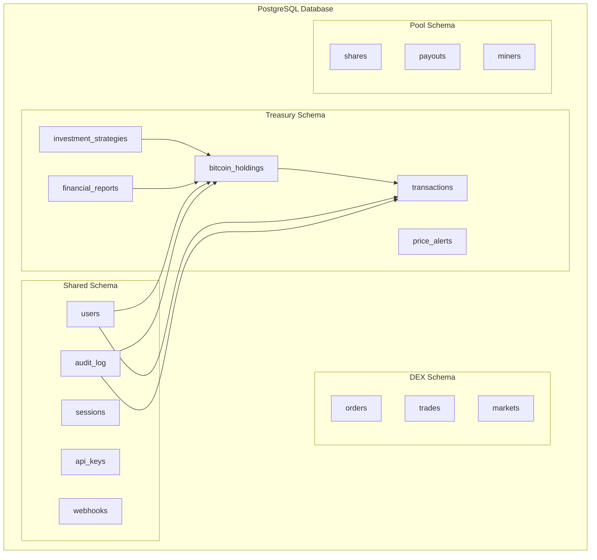

# Treasury Database Schema

The BLGV Treasury platform uses a multi-schema PostgreSQL database design to ensure data isolation, scalability, and security across the ecosystem.

## 🏗️ **Schema Architecture**



## 💰 **Treasury Core Tables**

### bitcoin_holdings
Primary table for tracking Bitcoin holdings across different addresses and wallets.

```sql
CREATE TABLE treasury.bitcoin_holdings (
    id SERIAL PRIMARY KEY,
    address VARCHAR(62) NOT NULL UNIQUE,
    address_type VARCHAR(20) NOT NULL CHECK (address_type IN ('p2pkh', 'p2sh', 'p2wpkh', 'p2wsh', 'p2tr')),
    wallet_type VARCHAR(20) NOT NULL CHECK (wallet_type IN ('hot', 'cold', 'multisig', 'custody')),
    balance DECIMAL(16,8) NOT NULL DEFAULT 0,
    confirmed_balance DECIMAL(16,8) NOT NULL DEFAULT 0,
    unconfirmed_balance DECIMAL(16,8) NOT NULL DEFAULT 0,
    label VARCHAR(255),
    description TEXT,
    derivation_path VARCHAR(100),
    xpub TEXT,
    threshold INTEGER, -- For multisig wallets
    required_signers INTEGER, -- For multisig wallets
    is_active BOOLEAN NOT NULL DEFAULT true,
    last_sync_at TIMESTAMP WITH TIME ZONE,
    created_at TIMESTAMP WITH TIME ZONE DEFAULT CURRENT_TIMESTAMP,
    updated_at TIMESTAMP WITH TIME ZONE DEFAULT CURRENT_TIMESTAMP
);

-- Indexes for performance
CREATE INDEX idx_bitcoin_holdings_address ON treasury.bitcoin_holdings(address);
CREATE INDEX idx_bitcoin_holdings_wallet_type ON treasury.bitcoin_holdings(wallet_type);
CREATE INDEX idx_bitcoin_holdings_active ON treasury.bitcoin_holdings(is_active);
CREATE INDEX idx_bitcoin_holdings_balance ON treasury.bitcoin_holdings(balance DESC);

-- Trigger for updated_at
CREATE OR REPLACE FUNCTION treasury.update_updated_at_column()
RETURNS TRIGGER AS $$
BEGIN
    NEW.updated_at = CURRENT_TIMESTAMP;
    RETURN NEW;
END;
$$ language 'plpgsql';

CREATE TRIGGER update_bitcoin_holdings_updated_at 
    BEFORE UPDATE ON treasury.bitcoin_holdings 
    FOR EACH ROW EXECUTE FUNCTION treasury.update_updated_at_column();
```

### transactions
Comprehensive transaction tracking with support for multi-input/output transactions.

```sql
CREATE TABLE treasury.transactions (
    id SERIAL PRIMARY KEY,
    txid VARCHAR(64) NOT NULL UNIQUE,
    block_hash VARCHAR(64),
    block_height INTEGER,
    transaction_type VARCHAR(20) NOT NULL CHECK (transaction_type IN ('purchase', 'sale', 'transfer', 'fee', 'consolidation')),
    amount DECIMAL(16,8) NOT NULL,
    fee DECIMAL(16,8) NOT NULL DEFAULT 0,
    fee_rate INTEGER, -- sat/vB
    confirmations INTEGER NOT NULL DEFAULT 0,
    status VARCHAR(20) NOT NULL DEFAULT 'pending' CHECK (status IN ('pending', 'confirmed', 'failed', 'cancelled')),
    from_addresses TEXT[], -- Array of input addresses
    to_addresses TEXT[], -- Array of output addresses
    change_addresses TEXT[], -- Array of change addresses
    raw_transaction TEXT, -- Full raw transaction hex
    strategy_id INTEGER REFERENCES treasury.investment_strategies(id),
    purchase_price DECIMAL(16,2), -- USD price at time of purchase
    exchange_rate DECIMAL(16,2), -- BTC/USD rate at transaction time
    external_reference VARCHAR(255), -- Reference to external system
    notes TEXT,
    created_at TIMESTAMP WITH TIME ZONE DEFAULT CURRENT_TIMESTAMP,
    updated_at TIMESTAMP WITH TIME ZONE DEFAULT CURRENT_TIMESTAMP
);

-- Indexes
CREATE INDEX idx_transactions_txid ON treasury.transactions(txid);
CREATE INDEX idx_transactions_type ON treasury.transactions(transaction_type);
CREATE INDEX idx_transactions_status ON treasury.transactions(status);
CREATE INDEX idx_transactions_block_height ON treasury.transactions(block_height DESC);
CREATE INDEX idx_transactions_amount ON treasury.transactions(amount DESC);
CREATE INDEX idx_transactions_created_at ON treasury.transactions(created_at DESC);
CREATE INDEX idx_transactions_from_addresses ON treasury.transactions USING GIN(from_addresses);
CREATE INDEX idx_transactions_to_addresses ON treasury.transactions USING GIN(to_addresses);

-- Trigger for updated_at
CREATE TRIGGER update_transactions_updated_at 
    BEFORE UPDATE ON treasury.transactions 
    FOR EACH ROW EXECUTE FUNCTION treasury.update_updated_at_column();
```

### investment_strategies
Dollar-cost averaging and investment strategy configurations.

```sql
CREATE TABLE treasury.investment_strategies (
    id SERIAL PRIMARY KEY,
    name VARCHAR(255) NOT NULL,
    strategy_type VARCHAR(20) NOT NULL CHECK (strategy_type IN ('dca', 'lump_sum', 'manual', 'algorithmic')),
    status VARCHAR(20) NOT NULL DEFAULT 'active' CHECK (status IN ('active', 'paused', 'completed', 'cancelled')),
    amount_per_purchase DECIMAL(16,2) NOT NULL, -- USD amount
    frequency VARCHAR(20) CHECK (frequency IN ('daily', 'weekly', 'monthly', 'quarterly')),
    max_price_threshold DECIMAL(16,2), -- Max BTC price for purchases
    min_price_threshold DECIMAL(16,2), -- Min BTC price for purchases
    total_allocated DECIMAL(16,2) NOT NULL, -- Total USD allocated to strategy
    total_spent DECIMAL(16,2) NOT NULL DEFAULT 0, -- Total USD spent so far
    total_btc_acquired DECIMAL(16,8) NOT NULL DEFAULT 0, -- Total BTC acquired
    average_cost_basis DECIMAL(16,2), -- Average purchase price
    next_execution_at TIMESTAMP WITH TIME ZONE,
    execution_count INTEGER NOT NULL DEFAULT 0,
    max_executions INTEGER, -- Null for unlimited
    target_addresses TEXT[], -- Addresses to receive purchased BTC
    external_api_config JSONB, -- Configuration for external exchange APIs
    created_by INTEGER REFERENCES shared.users(id),
    created_at TIMESTAMP WITH TIME ZONE DEFAULT CURRENT_TIMESTAMP,
    updated_at TIMESTAMP WITH TIME ZONE DEFAULT CURRENT_TIMESTAMP
);

-- Indexes
CREATE INDEX idx_investment_strategies_status ON treasury.investment_strategies(status);
CREATE INDEX idx_investment_strategies_type ON treasury.investment_strategies(strategy_type);
CREATE INDEX idx_investment_strategies_next_execution ON treasury.investment_strategies(next_execution_at);
CREATE INDEX idx_investment_strategies_created_by ON treasury.investment_strategies(created_by);

-- Trigger for updated_at
CREATE TRIGGER update_investment_strategies_updated_at 
    BEFORE UPDATE ON treasury.investment_strategies 
    FOR EACH ROW EXECUTE FUNCTION treasury.update_updated_at_column();
```

### financial_reports
Generated financial reports and analytics.

```sql
CREATE TABLE treasury.financial_reports (
    id SERIAL PRIMARY KEY,
    report_type VARCHAR(50) NOT NULL CHECK (report_type IN ('monthly', 'quarterly', 'annual', 'custom')),
    period_start DATE NOT NULL,
    period_end DATE NOT NULL,
    status VARCHAR(20) NOT NULL DEFAULT 'generating' CHECK (status IN ('generating', 'completed', 'failed')),
    
    -- Financial metrics
    opening_btc_balance DECIMAL(16,8) NOT NULL,
    closing_btc_balance DECIMAL(16,8) NOT NULL,
    btc_purchased DECIMAL(16,8) NOT NULL DEFAULT 0,
    btc_sold DECIMAL(16,8) NOT NULL DEFAULT 0,
    total_fees_paid DECIMAL(16,8) NOT NULL DEFAULT 0,
    
    -- USD metrics
    opening_usd_value DECIMAL(16,2) NOT NULL,
    closing_usd_value DECIMAL(16,2) NOT NULL,
    usd_invested DECIMAL(16,2) NOT NULL DEFAULT 0,
    usd_divested DECIMAL(16,2) NOT NULL DEFAULT 0,
    
    -- Performance metrics
    realized_gains DECIMAL(16,2) NOT NULL DEFAULT 0,
    unrealized_gains DECIMAL(16,2) NOT NULL DEFAULT 0,
    total_return_percent DECIMAL(8,4),
    btc_per_share DECIMAL(16,8),
    shares_outstanding BIGINT,
    
    -- Additional data
    report_data JSONB, -- Full report data in JSON format
    file_path VARCHAR(500), -- Path to generated PDF/Excel file
    generated_by INTEGER REFERENCES shared.users(id),
    generated_at TIMESTAMP WITH TIME ZONE,
    created_at TIMESTAMP WITH TIME ZONE DEFAULT CURRENT_TIMESTAMP
);

-- Indexes
CREATE INDEX idx_financial_reports_type ON treasury.financial_reports(report_type);
CREATE INDEX idx_financial_reports_period ON treasury.financial_reports(period_start, period_end);
CREATE INDEX idx_financial_reports_status ON treasury.financial_reports(status);
CREATE INDEX idx_financial_reports_created_at ON treasury.financial_reports(created_at DESC);
```

### price_alerts
Price alert configurations and notifications.

```sql
CREATE TABLE treasury.price_alerts (
    id SERIAL PRIMARY KEY,
    user_id INTEGER NOT NULL REFERENCES shared.users(id),
    alert_type VARCHAR(20) NOT NULL CHECK (alert_type IN ('price_above', 'price_below', 'change_percent', 'volume')),
    status VARCHAR(20) NOT NULL DEFAULT 'active' CHECK (status IN ('active', 'triggered', 'cancelled')),
    
    -- Alert conditions
    target_value DECIMAL(16,2) NOT NULL, -- Price or percentage threshold
    comparison_operator VARCHAR(10) NOT NULL CHECK (comparison_operator IN ('>', '<', '>=', '<=')),
    timeframe_hours INTEGER DEFAULT 1, -- For percentage change alerts
    
    -- Notification settings
    notification_methods TEXT[] NOT NULL DEFAULT ARRAY['email'], -- email, sms, webhook, push
    notification_message TEXT,
    webhook_url VARCHAR(500),
    
    -- Execution tracking
    triggered_at TIMESTAMP WITH TIME ZONE,
    triggered_price DECIMAL(16,2),
    trigger_count INTEGER NOT NULL DEFAULT 0,
    max_triggers INTEGER DEFAULT 1, -- Null for unlimited
    cooldown_hours INTEGER DEFAULT 24, -- Hours between triggers
    last_check_at TIMESTAMP WITH TIME ZONE,
    
    created_at TIMESTAMP WITH TIME ZONE DEFAULT CURRENT_TIMESTAMP,
    updated_at TIMESTAMP WITH TIME ZONE DEFAULT CURRENT_TIMESTAMP
);

-- Indexes
CREATE INDEX idx_price_alerts_user_id ON treasury.price_alerts(user_id);
CREATE INDEX idx_price_alerts_status ON treasury.price_alerts(status);
CREATE INDEX idx_price_alerts_type ON treasury.price_alerts(alert_type);
CREATE INDEX idx_price_alerts_active ON treasury.price_alerts(status) WHERE status = 'active';

-- Trigger for updated_at
CREATE TRIGGER update_price_alerts_updated_at 
    BEFORE UPDATE ON treasury.price_alerts 
    FOR EACH ROW EXECUTE FUNCTION treasury.update_updated_at_column();
```

## 📊 **Analytics Views**

### Treasury Summary View
```sql
CREATE VIEW treasury.treasury_summary AS
SELECT 
    SUM(balance) as total_btc,
    SUM(CASE WHEN wallet_type = 'cold' THEN balance ELSE 0 END) as cold_storage_btc,
    SUM(CASE WHEN wallet_type = 'hot' THEN balance ELSE 0 END) as hot_wallet_btc,
    SUM(CASE WHEN wallet_type = 'multisig' THEN balance ELSE 0 END) as multisig_btc,
    COUNT(*) as total_addresses,
    COUNT(*) FILTER (WHERE is_active = true) as active_addresses,
    AVG(balance) as average_balance_per_address,
    MAX(updated_at) as last_sync_time
FROM treasury.bitcoin_holdings 
WHERE is_active = true;
```

### Performance Metrics View
```sql
CREATE VIEW treasury.performance_metrics AS
WITH monthly_data AS (
    SELECT 
        DATE_TRUNC('month', created_at) as month,
        SUM(CASE WHEN transaction_type = 'purchase' THEN amount ELSE 0 END) as btc_purchased,
        SUM(CASE WHEN transaction_type = 'purchase' THEN amount * purchase_price ELSE 0 END) as usd_invested,
        AVG(CASE WHEN transaction_type = 'purchase' THEN purchase_price ELSE NULL END) as avg_purchase_price
    FROM treasury.transactions 
    WHERE status = 'confirmed'
        AND created_at >= DATE_TRUNC('year', CURRENT_DATE)
    GROUP BY DATE_TRUNC('month', created_at)
)
SELECT 
    month,
    btc_purchased,
    usd_invested,
    avg_purchase_price,
    SUM(btc_purchased) OVER (ORDER BY month) as cumulative_btc,
    SUM(usd_invested) OVER (ORDER BY month) as cumulative_usd,
    SUM(usd_invested) OVER (ORDER BY month) / NULLIF(SUM(btc_purchased) OVER (ORDER BY month), 0) as cumulative_avg_price
FROM monthly_data
ORDER BY month;
```

## 🔐 **Security Features**

### Row Level Security (RLS)
```sql
-- Enable RLS on sensitive tables
ALTER TABLE treasury.bitcoin_holdings ENABLE ROW LEVEL SECURITY;
ALTER TABLE treasury.transactions ENABLE ROW LEVEL SECURITY;
ALTER TABLE treasury.investment_strategies ENABLE ROW LEVEL SECURITY;

-- Admin access policy
CREATE POLICY treasury_admin_access ON treasury.bitcoin_holdings
    FOR ALL TO treasury_admin
    USING (true);

-- Read-only access for treasury viewers
CREATE POLICY treasury_read_access ON treasury.bitcoin_holdings
    FOR SELECT TO treasury_viewer
    USING (true);

-- Strategy access based on creator
CREATE POLICY strategy_creator_access ON treasury.investment_strategies
    FOR ALL TO treasury_user
    USING (created_by = current_user_id());
```

### Audit Trail
```sql
CREATE TABLE treasury.audit_trail (
    id SERIAL PRIMARY KEY,
    table_name VARCHAR(50) NOT NULL,
    operation VARCHAR(10) NOT NULL CHECK (operation IN ('INSERT', 'UPDATE', 'DELETE')),
    row_id INTEGER NOT NULL,
    old_values JSONB,
    new_values JSONB,
    changed_by INTEGER REFERENCES shared.users(id),
    changed_at TIMESTAMP WITH TIME ZONE DEFAULT CURRENT_TIMESTAMP,
    ip_address INET,
    user_agent TEXT
);

-- Audit trigger function
CREATE OR REPLACE FUNCTION treasury.audit_trigger()
RETURNS TRIGGER AS $$
BEGIN
    IF TG_OP = 'DELETE' THEN
        INSERT INTO treasury.audit_trail (table_name, operation, row_id, old_values, changed_by)
        VALUES (TG_TABLE_NAME, TG_OP, OLD.id, to_jsonb(OLD), current_user_id());
        RETURN OLD;
    ELSIF TG_OP = 'UPDATE' THEN
        INSERT INTO treasury.audit_trail (table_name, operation, row_id, old_values, new_values, changed_by)
        VALUES (TG_TABLE_NAME, TG_OP, NEW.id, to_jsonb(OLD), to_jsonb(NEW), current_user_id());
        RETURN NEW;
    ELSIF TG_OP = 'INSERT' THEN
        INSERT INTO treasury.audit_trail (table_name, operation, row_id, new_values, changed_by)
        VALUES (TG_TABLE_NAME, TG_OP, NEW.id, to_jsonb(NEW), current_user_id());
        RETURN NEW;
    END IF;
    RETURN NULL;
END;
$$ LANGUAGE plpgsql;

-- Apply audit triggers
CREATE TRIGGER bitcoin_holdings_audit 
    AFTER INSERT OR UPDATE OR DELETE ON treasury.bitcoin_holdings
    FOR EACH ROW EXECUTE FUNCTION treasury.audit_trigger();

CREATE TRIGGER transactions_audit 
    AFTER INSERT OR UPDATE OR DELETE ON treasury.transactions
    FOR EACH ROW EXECUTE FUNCTION treasury.audit_trigger();
```

## ⚡ **Performance Optimization**

### Partitioning
```sql
-- Partition transactions by year for better performance
CREATE TABLE treasury.transactions_2025 PARTITION OF treasury.transactions
    FOR VALUES FROM ('2025-01-01') TO ('2026-01-01');

CREATE TABLE treasury.transactions_2024 PARTITION OF treasury.transactions
    FOR VALUES FROM ('2024-01-01') TO ('2025-01-01');

-- Auto-create partitions function
CREATE OR REPLACE FUNCTION treasury.create_transaction_partition(year_val INTEGER)
RETURNS void AS $$
DECLARE
    partition_name TEXT;
    start_date DATE;
    end_date DATE;
BEGIN
    partition_name := 'transactions_' || year_val;
    start_date := make_date(year_val, 1, 1);
    end_date := make_date(year_val + 1, 1, 1);
    
    EXECUTE format('CREATE TABLE treasury.%I PARTITION OF treasury.transactions
                    FOR VALUES FROM (%L) TO (%L)',
                   partition_name, start_date, end_date);
END;
$$ LANGUAGE plpgsql;
```

### Materialized Views for Analytics
```sql
-- Treasury performance materialized view
CREATE MATERIALIZED VIEW treasury.daily_performance AS
SELECT 
    date_trunc('day', t.created_at) as date,
    SUM(t.amount) FILTER (WHERE t.transaction_type = 'purchase') as daily_purchases,
    AVG(t.purchase_price) FILTER (WHERE t.transaction_type = 'purchase') as avg_purchase_price,
    COUNT(*) FILTER (WHERE t.transaction_type = 'purchase') as purchase_count,
    (SELECT SUM(balance) FROM treasury.bitcoin_holdings WHERE updated_at::date <= date_trunc('day', t.created_at)::date) as total_balance
FROM treasury.transactions t
WHERE t.status = 'confirmed'
GROUP BY date_trunc('day', t.created_at)
ORDER BY date DESC;

-- Refresh daily at midnight
CREATE EXTENSION IF NOT EXISTS pg_cron;
SELECT cron.schedule('refresh-treasury-performance', '0 0 * * *', 'REFRESH MATERIALIZED VIEW treasury.daily_performance;');
```

## 🔄 **Data Synchronization**

### Bitcoin Core Integration
```sql
-- Bitcoin addresses to monitor
CREATE TABLE treasury.monitored_addresses (
    id SERIAL PRIMARY KEY,
    address VARCHAR(62) NOT NULL UNIQUE,
    address_type VARCHAR(20) NOT NULL,
    label VARCHAR(255),
    is_change BOOLEAN DEFAULT false,
    derivation_index INTEGER,
    last_used_at TIMESTAMP WITH TIME ZONE,
    created_at TIMESTAMP WITH TIME ZONE DEFAULT CURRENT_TIMESTAMP
);

-- UTXO tracking
CREATE TABLE treasury.utxos (
    id SERIAL PRIMARY KEY,
    txid VARCHAR(64) NOT NULL,
    vout INTEGER NOT NULL,
    address VARCHAR(62) NOT NULL,
    amount DECIMAL(16,8) NOT NULL,
    script_pub_key TEXT NOT NULL,
    confirmations INTEGER NOT NULL DEFAULT 0,
    is_spendable BOOLEAN NOT NULL DEFAULT true,
    is_change BOOLEAN NOT NULL DEFAULT false,
    block_height INTEGER,
    spent_txid VARCHAR(64), -- Transaction that spent this UTXO
    spent_at TIMESTAMP WITH TIME ZONE,
    created_at TIMESTAMP WITH TIME ZONE DEFAULT CURRENT_TIMESTAMP,
    
    UNIQUE(txid, vout)
);

-- Indexes for UTXO management
CREATE INDEX idx_utxos_address ON treasury.utxos(address);
CREATE INDEX idx_utxos_spendable ON treasury.utxos(is_spendable) WHERE is_spendable = true;
CREATE INDEX idx_utxos_amount ON treasury.utxos(amount DESC);
CREATE INDEX idx_utxos_confirmations ON treasury.utxos(confirmations);
```

## 📈 **Reporting Functions**

### BTC-per-Share Calculation
```sql
CREATE OR REPLACE FUNCTION treasury.calculate_btc_per_share(
    shares_outstanding BIGINT DEFAULT 1000000
) RETURNS DECIMAL(16,8) AS $$
DECLARE
    total_btc DECIMAL(16,8);
BEGIN
    SELECT SUM(balance) INTO total_btc 
    FROM treasury.bitcoin_holdings 
    WHERE is_active = true;
    
    RETURN COALESCE(total_btc / shares_outstanding, 0);
END;
$$ LANGUAGE plpgsql;
```

### Treasury Valuation
```sql
CREATE OR REPLACE FUNCTION treasury.calculate_treasury_value(
    btc_price DECIMAL(16,2)
) RETURNS TABLE(
    total_btc DECIMAL(16,8),
    total_usd_value DECIMAL(16,2),
    cost_basis DECIMAL(16,2),
    unrealized_gains DECIMAL(16,2),
    total_return_percent DECIMAL(8,4)
) AS $$
DECLARE
    total_invested DECIMAL(16,2);
BEGIN
    -- Get total BTC holdings
    SELECT SUM(balance) INTO total_btc 
    FROM treasury.bitcoin_holdings 
    WHERE is_active = true;
    
    -- Calculate current USD value
    total_usd_value := total_btc * btc_price;
    
    -- Get total amount invested
    SELECT SUM(amount * purchase_price) INTO total_invested
    FROM treasury.transactions 
    WHERE transaction_type = 'purchase' AND status = 'confirmed';
    
    cost_basis := COALESCE(total_invested, 0);
    unrealized_gains := total_usd_value - cost_basis;
    
    IF cost_basis > 0 THEN
        total_return_percent := (unrealized_gains / cost_basis) * 100;
    ELSE
        total_return_percent := 0;
    END IF;
    
    RETURN NEXT;
END;
$$ LANGUAGE plpgsql;
```

## 🔧 **Maintenance Procedures**

### Data Cleanup
```sql
-- Archive old audit trail entries
CREATE OR REPLACE FUNCTION treasury.archive_old_audit_data()
RETURNS void AS $$
BEGIN
    -- Move audit records older than 2 years to archive table
    INSERT INTO treasury.audit_trail_archive 
    SELECT * FROM treasury.audit_trail 
    WHERE changed_at < CURRENT_DATE - INTERVAL '2 years';
    
    -- Delete archived records from main table
    DELETE FROM treasury.audit_trail 
    WHERE changed_at < CURRENT_DATE - INTERVAL '2 years';
    
    RAISE NOTICE 'Archived % audit trail records', ROW_COUNT;
END;
$$ LANGUAGE plpgsql;
```

### Health Checks
```sql
-- Treasury health check function
CREATE OR REPLACE FUNCTION treasury.health_check()
RETURNS TABLE(
    check_name TEXT,
    status TEXT,
    details TEXT
) AS $$
BEGIN
    -- Check for stale address balances
    RETURN QUERY
    SELECT 
        'stale_balances'::TEXT,
        CASE WHEN COUNT(*) > 0 THEN 'WARNING' ELSE 'OK' END,
        COUNT(*)::TEXT || ' addresses not synced in 24 hours'
    FROM treasury.bitcoin_holdings 
    WHERE last_sync_at < CURRENT_TIMESTAMP - INTERVAL '24 hours'
        AND is_active = true;
    
    -- Check for failed transactions
    RETURN QUERY
    SELECT 
        'failed_transactions'::TEXT,
        CASE WHEN COUNT(*) > 0 THEN 'ERROR' ELSE 'OK' END,
        COUNT(*)::TEXT || ' failed transactions in last 24 hours'
    FROM treasury.transactions 
    WHERE status = 'failed' 
        AND created_at > CURRENT_TIMESTAMP - INTERVAL '24 hours';
    
    -- Check total balance consistency
    RETURN QUERY
    SELECT 
        'balance_consistency'::TEXT,
        'OK'::TEXT,
        'Total BTC: ' || SUM(balance)::TEXT
    FROM treasury.bitcoin_holdings 
    WHERE is_active = true;
    
END;
$$ LANGUAGE plpgsql;
```

---

**Need help?** Check our [Treasury Platform](../platforms/treasury.md) or reach out via [GitHub Issues](https://github.com/BlockSavvy/Unified-Treasury-System/issues). 