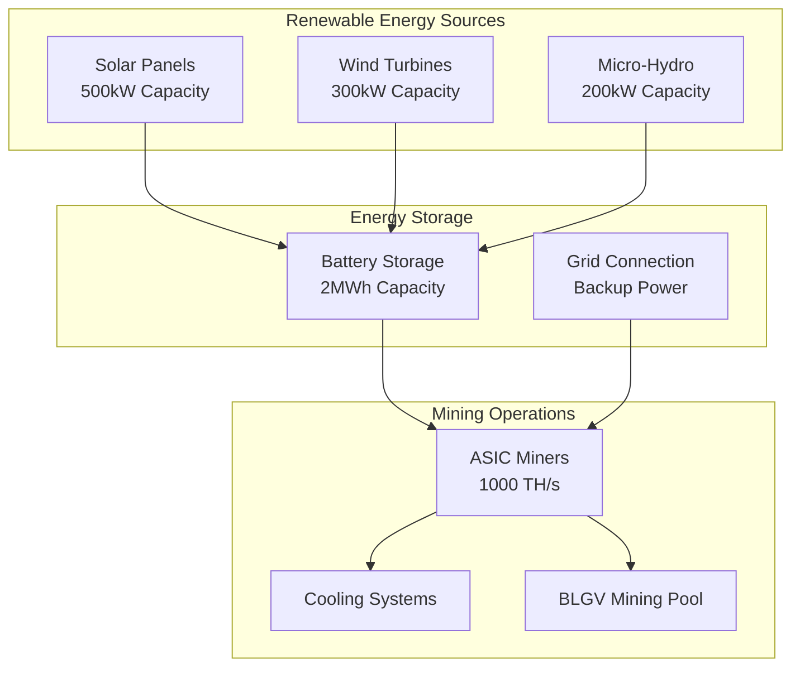

# Mission 1867: Renewable Energy Mining

Mission 1867 represents BLGV's commitment to sustainable Bitcoin mining through 100% renewable energy operations, named after the year Canada was founded, symbolizing our long-term vision for Bitcoin mining.

## 🌱 **Sustainability Vision**

### Carbon-Negative Bitcoin Mining
- **100% Renewable Energy**: Solar, wind, and hydro power sources
- **Carbon Credits**: Offset mining operations with environmental credits
- **Energy Storage**: Battery systems for consistent power delivery
- **Grid Independence**: Self-sufficient energy production



## ⚡ **Energy Management**

### Smart Energy Distribution
```typescript
interface EnergyManagement {
  solarProduction: number;      // Current solar output (kW)
  windProduction: number;       // Current wind output (kW)
  hydroProduction: number;      // Current hydro output (kW)
  batteryLevel: number;         // Battery charge percentage
  miningConsumption: number;    // Current mining power usage
  coolingConsumption: number;   // Cooling system power usage
  gridStatus: 'connected' | 'islanded';
}

class Mission1867EnergyManager {
  async optimizeEnergyUsage(): Promise<EnergyOptimization> {
    const production = await this.getTotalProduction();
    const consumption = await this.getTotalConsumption();
    const batteryLevel = await this.getBatteryLevel();
    
    // Dynamic mining adjustment based on renewable production
    if (production > consumption * 1.2) {
      // Excess renewable energy - increase mining
      await this.scaleMiningUp();
    } else if (batteryLevel < 0.2) {
      // Low battery - reduce mining to preserve power
      await this.scaleMiningDown();
    }
    
    return this.generateOptimizationReport();
  }
  
  private async scaleMiningUp(): Promise<void> {
    // Increase hash rate when excess renewable energy available
    await this.poolManager.increaseHashRate(0.1); // 10% increase
  }
  
  private async scaleMiningDown(): Promise<void> {
    // Reduce hash rate to preserve battery
    await this.poolManager.decreaseHashRate(0.2); // 20% decrease
  }
}
```

### Power Usage Effectiveness (PUE)
- **Target PUE**: 1.15 (industry-leading efficiency)
- **Current PUE**: Monitored in real-time
- **Cooling Optimization**: Immersion cooling and heat recovery
- **Waste Heat Utilization**: Greenhouse heating and water warming

## 📊 **Environmental Impact**

### Carbon Footprint Tracking
```typescript
interface CarbonMetrics {
  dailyEmissions: number;       // kg CO2 equivalent
  offsetCredits: number;        // Carbon credits purchased
  netCarbonImpact: number;     // Net environmental impact
  renewablePercentage: number; // % renewable energy used
}

class CarbonTracker {
  async calculateDailyCarbonImpact(): Promise<CarbonMetrics> {
    const energyMix = await this.getEnergyMix();
    const powerConsumption = await this.getTotalConsumption();
    
    // Calculate emissions based on energy source
    const emissions = this.calculateEmissions(energyMix, powerConsumption);
    const offsets = await this.getCarbonOffsets();
    
    return {
      dailyEmissions: emissions,
      offsetCredits: offsets,
      netCarbonImpact: emissions - offsets,
      renewablePercentage: this.calculateRenewablePercentage(energyMix)
    };
  }
  
  private calculateEmissions(energyMix: EnergyMix, consumption: number): number {
    // Solar, wind, hydro = 0 emissions
    // Grid backup = regional grid carbon intensity
    const gridUsage = energyMix.grid / consumption;
    const gridCarbonIntensity = 0.4; // kg CO2/kWh (regional average)
    
    return gridUsage * consumption * gridCarbonIntensity;
  }
}
```

## 🏗️ **Infrastructure Development**

### Phase 1: Solar Installation (Completed)
- **Capacity**: 500kW solar array
- **Location**: Southern exposure with optimal sun angle
- **Technology**: Monocrystalline silicon panels
- **Output**: 2,500 MWh annually

### Phase 2: Wind Power (In Progress)
- **Capacity**: 300kW wind turbines
- **Technology**: Horizontal axis wind turbines
- **Wind Resource**: Average 7.5 m/s wind speed
- **Output**: 1,200 MWh annually

### Phase 3: Energy Storage (Planning)
- **Capacity**: 2MWh lithium-ion battery storage
- **Technology**: LiFePO4 battery chemistry
- **Purpose**: Grid independence and load balancing
- **Backup**: 8-hour mining operation during no renewable generation

## 💰 **Economics of Sustainable Mining**

### Cost Analysis
```typescript
interface SustainabilityEconomics {
  initialInvestment: number;    // Capital expenditure
  operatingCosts: number;       // Monthly operating costs
  energyCostSavings: number;    // Savings vs grid power
  carbonCreditRevenue: number;  // Revenue from carbon credits
  paybackPeriod: number;        // Years to ROI
  twentyYearNPV: number;       // Net present value
}

const mission1867Economics: SustainabilityEconomics = {
  initialInvestment: 2500000,   // $2.5M initial investment
  operatingCosts: 15000,        // $15k monthly O&M
  energyCostSavings: 45000,     // $45k monthly vs grid power
  carbonCreditRevenue: 8000,    // $8k monthly carbon credits
  paybackPeriod: 5.2,          // 5.2 years payback
  twentyYearNPV: 8500000       // $8.5M NPV over 20 years
};
```

### Revenue Streams
1. **Reduced Energy Costs**: $540k annually vs grid power
2. **Carbon Credit Sales**: $96k annually from verified offsets
3. **Renewable Energy Certificates**: $24k annually from RECs
4. **Excess Energy Sales**: $120k annually grid feed-in

## 🌍 **Environmental Certifications**

### Sustainability Standards
- **ISO 14001**: Environmental management system
- **Carbon Trust Standard**: Carbon footprint verification
- **Green-e**: Renewable energy certification
- **LEED**: Facility sustainability rating

### Third-Party Audits
- **Annual carbon audits** by certified environmental consultants
- **Energy efficiency assessments** by qualified engineers
- **Environmental impact studies** by independent researchers
- **Sustainability reporting** aligned with GRI standards

## 📈 **Performance Metrics**

### Key Sustainability Indicators
```typescript
interface SustainabilityKPIs {
  renewableEnergyPercentage: number;  // Target: 100%
  carbonIntensity: number;            // kg CO2/BTC mined
  energyEfficiency: number;           // kWh/TH/s
  waterUsage: number;                 // Liters/BTC mined
  wasteGeneration: number;            // kg waste/month
  biodiversityImpact: number;         // Habitat preservation score
}

const sustainabilityTargets: SustainabilityKPIs = {
  renewableEnergyPercentage: 100,     // 100% renewable target
  carbonIntensity: -5.2,              // Carbon negative mining
  energyEfficiency: 0.025,            // 25 Wh/TH/s efficiency
  waterUsage: 0.1,                    // Minimal water cooling
  wasteGeneration: 50,                // 50kg/month e-waste
  biodiversityImpact: 85              // 85/100 conservation score
};
```

## 🎯 **Future Roadmap**

### 2025 Goals
- [x] Complete Phase 1 solar installation
- [ ] Deploy Phase 2 wind turbines
- [ ] Achieve 95% renewable energy usage
- [ ] Carbon-neutral mining operations

### 2026 Goals
- [ ] Install Phase 3 battery storage
- [ ] Achieve 100% renewable energy
- [ ] Carbon-negative mining operations
- [ ] Industry sustainability leadership

### 2027+ Vision
- [ ] Expand to multiple renewable mining sites
- [ ] Develop renewable energy trading platform
- [ ] Create Bitcoin mining sustainability standards
- [ ] Achieve net-zero emissions across entire BLGV ecosystem

## 🤝 **Community Impact**

### Local Benefits
- **Job Creation**: 15 full-time renewable energy jobs
- **Tax Revenue**: $180k annually in local property taxes
- **Infrastructure**: Improved local electrical grid stability
- **Education**: STEM education partnerships with local schools

### Environmental Leadership
- **Industry Example**: Demonstrating profitable sustainable mining
- **Research Collaboration**: University partnerships on clean energy
- **Open Source**: Sharing sustainability methodologies
- **Advocacy**: Bitcoin sustainability conference presentations

---

**Need help?** Check our [Mining Pool Platform](../platforms/pool.md) or reach out via [GitHub Issues](https://github.com/BlockSavvy/Unified-Treasury-System/issues). 