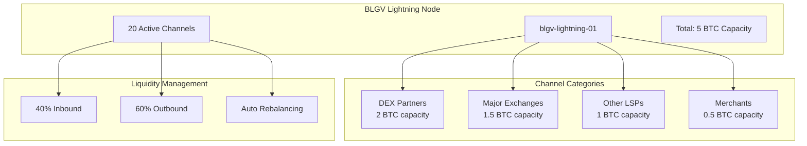

# Lightning Channel Management Guide

Effective Lightning channel management is crucial for maintaining optimal liquidity, maximizing routing revenue, and ensuring reliable payments across the BLGV ecosystem.

## ⚡ **Channel Strategy Overview**

### BLGV Channel Philosophy
- **Strategic Partnerships**: Open channels with high-volume trading partners
- **Liquidity Optimization**: Maintain 60/40 outbound/inbound liquidity ratio
- **Geographic Distribution**: Channels across multiple regions for redundancy
- **Risk Management**: Diversified channel portfolio with position limits



## 🎯 **Channel Selection Criteria**

### Target Node Identification
```typescript
interface ChannelCandidate {
  nodeId: string;
  alias: string;
  capacity: number;
  channelCount: number;
  connectedness: number;
  uptime: number;
  feePolicy: FeePolicy;
  riskScore: number;
  strategicValue: number;
}

class ChannelSelector {
  async identifyTargetNodes(): Promise<ChannelCandidate[]> {
    // Get network graph
    const networkGraph = await this.lightning.describeGraph();
    
    // Score potential partners
    const candidates = networkGraph.nodes.map(node => ({
      ...node,
      connectedness: this.calculateConnectedness(node),
      uptime: this.calculateUptime(node),
      riskScore: this.assessRisk(node),
      strategicValue: this.assessStrategicValue(node)
    }));
    
    // Filter and rank candidates
    return candidates
      .filter(node => this.meetsMinimumCriteria(node))
      .sort((a, b) => this.scoreCandidate(b) - this.scoreCandidate(a))
      .slice(0, 50); // Top 50 candidates
  }
  
  private calculateConnectedness(node: any): number {
    // Calculate how well-connected the node is
    const channelCount = node.num_channels;
    const totalCapacity = node.total_capacity;
    
    return (channelCount * 0.3) + (totalCapacity / 100000000 * 0.7);
  }
  
  private assessStrategicValue(node: any): number {
    // Assess strategic value for BLGV ecosystem
    const strategicPartners = [
      'kraken', 'coinbase', 'binance', 'bitfinex', // Exchanges
      'sphinx', 'voltage', 'amboss', // Lightning services
      'btcpayserver', 'opensats' // Bitcoin services
    ];
    
    const isStrategic = strategicPartners.some(partner => 
      node.alias.toLowerCase().includes(partner)
    );
    
    return isStrategic ? 100 : 0;
  }
}
```

### Channel Size Optimization
```typescript
class ChannelSizeOptimizer {
  async calculateOptimalSize(targetNode: string): Promise<number> {
    // Analyze historical payment patterns
    const paymentHistory = await this.getPaymentHistory(targetNode);
    
    // Calculate volume-based size
    const avgDaily = this.calculateAverageDaily(paymentHistory);
    const maxDaily = this.calculateMaxDaily(paymentHistory);
    
    // Factor in liquidity requirements
    const baseSize = Math.max(avgDaily * 3, maxDaily * 1.2);
    
    // Apply business rules
    const minSize = 0.01 * 100000000; // 0.01 BTC
    const maxSize = 1.0 * 100000000;  // 1.0 BTC
    
    return Math.max(minSize, Math.min(maxSize, baseSize));
  }
  
  private calculateAverageDaily(payments: Payment[]): number {
    const dailyVolumes = this.groupByDay(payments);
    return dailyVolumes.reduce((sum, vol) => sum + vol, 0) / dailyVolumes.length;
  }
}
```

## 🔧 **Channel Opening Process**

### Automated Channel Opening
```typescript
class ChannelOpener {
  async openStrategicChannels(): Promise<Channel[]> {
    const targets = await this.channelSelector.identifyTargetNodes();
    const budget = await this.calculateChannelBudget();
    
    const channels: Channel[] = [];
    let remainingBudget = budget;
    
    for (const target of targets) {
      if (remainingBudget <= 0) break;
      
      const channelSize = await this.calculateOptimalSize(target.nodeId);
      
      if (channelSize <= remainingBudget) {
        try {
          const channel = await this.openChannel({
            nodePubkey: target.nodeId,
            localFundingAmount: channelSize,
            targetConf: 3,
            satPerByte: await this.getOptimalFeeRate(),
            minHtlcMsat: 1000,
            remoteCsvDelay: 144
          });
          
          channels.push(channel);
          remainingBudget -= channelSize;
          
          // Log channel opening
          await this.logChannelEvent('opened', channel, target);
          
        } catch (error) {
          console.error(`Failed to open channel to ${target.alias}:`, error);
        }
      }
    }
    
    return channels;
  }
  
  async openChannel(params: ChannelOpenParams): Promise<Channel> {
    // Pre-flight checks
    await this.validateChannelParams(params);
    await this.checkLiquidity(params.localFundingAmount);
    
    // Open channel
    const channelStream = this.lightning.openChannel(params);
    
    return new Promise((resolve, reject) => {
      channelStream.on('data', (update) => {
        if (update.chanPending) {
          resolve({
            channelPoint: update.chanPending.txid,
            remotePubkey: params.nodePubkey,
            capacity: params.localFundingAmount,
            localBalance: params.localFundingAmount,
            remoteBalance: 0,
            active: false,
            pendingOpen: true
          });
        }
      });
      
      channelStream.on('error', reject);
    });
  }
}
```

### Channel Monitoring
```typescript
class ChannelMonitor {
  async monitorChannelHealth(): Promise<void> {
    const channels = await this.lightning.listChannels();
    
    for (const channel of channels) {
      const health = await this.assessChannelHealth(channel);
      
      if (health.riskScore > 80) {
        await this.handleHighRiskChannel(channel);
      }
      
      if (health.liquidityRatio < 0.2 || health.liquidityRatio > 0.8) {
        await this.scheduleRebalancing(channel);
      }
      
      if (health.utilizationRate < 0.1) {
        await this.evaluateChannelClosure(channel);
      }
    }
  }
  
  async assessChannelHealth(channel: Channel): Promise<ChannelHealth> {
    const now = Date.now();
    const dayAgo = now - 86400000;
    
    // Get channel metrics
    const payments = await this.getChannelPayments(channel.chanId, dayAgo);
    const forwardingEvents = await this.getForwardingEvents(channel.chanId, dayAgo);
    
    return {
      channelId: channel.chanId,
      liquidityRatio: channel.localBalance / channel.capacity,
      utilizationRate: this.calculateUtilization(payments, forwardingEvents),
      successRate: this.calculateSuccessRate(payments),
      feeEarnings: this.calculateFeeEarnings(forwardingEvents),
      riskScore: this.calculateRiskScore(channel),
      uptime: await this.calculateUptime(channel),
      lastActivity: this.getLastActivity(payments, forwardingEvents)
    };
  }
  
  private calculateRiskScore(channel: Channel): number {
    let riskScore = 0;
    
    // Channel age risk (newer = higher risk)
    const ageInDays = (Date.now() - channel.openTime) / 86400000;
    if (ageInDays < 7) riskScore += 30;
    else if (ageInDays < 30) riskScore += 15;
    
    // Liquidity imbalance risk
    const ratio = channel.localBalance / channel.capacity;
    if (ratio < 0.1 || ratio > 0.9) riskScore += 25;
    else if (ratio < 0.2 || ratio > 0.8) riskScore += 15;
    
    // Counterparty risk
    if (this.isUnknownCounterparty(channel.remotePubkey)) riskScore += 20;
    
    // Size risk (very large channels)
    if (channel.capacity > 50000000) riskScore += 10; // 0.5 BTC
    
    return Math.min(100, riskScore);
  }
}
```

## ⚖️ **Liquidity Management**

### Automated Rebalancing
```typescript
class LiquidityManager {
  async rebalanceChannels(): Promise<void> {
    const channels = await this.getImbalancedChannels();
    
    for (const channel of channels) {
      await this.executeRebalancing(channel);
    }
  }
  
  async executeRebalancing(channel: Channel): Promise<void> {
    const targetRatio = 0.6; // 60% outbound liquidity
    const currentRatio = channel.localBalance / channel.capacity;
    
    if (currentRatio < targetRatio) {
      // Need more outbound liquidity (receive payment)
      await this.rebalanceInbound(channel);
    } else {
      // Need more inbound liquidity (send payment)
      await this.rebalanceOutbound(channel);
    }
  }
  
  private async rebalanceOutbound(channel: Channel): Promise<void> {
    const targetAmount = channel.localBalance - (channel.capacity * 0.6);
    
    // Find rebalancing route
    const route = await this.findRebalancingRoute(
      channel.remotePubkey,
      targetAmount
    );
    
    if (route) {
      // Create circular payment to ourselves
      const invoice = await this.createRebalancingInvoice(targetAmount);
      
      try {
        await this.lightning.sendPaymentV2({
          paymentRequest: invoice.paymentRequest,
          outgoingChanId: channel.chanId,
          maxParts: 1,
          timeoutSeconds: 60
        });
        
        console.log(`Rebalanced ${targetAmount} sats outbound for channel ${channel.chanId}`);
        
      } catch (error) {
        console.error(`Rebalancing failed for channel ${channel.chanId}:`, error);
      }
    }
  }
  
  private async findRebalancingRoute(
    targetNode: string, 
    amount: number
  ): Promise<Route | null> {
    try {
      const routes = await this.lightning.queryRoutes({
        pubKey: this.nodeId, // Route back to ourselves
        amt: amount,
        feeLimit: { fixed: Math.floor(amount * 0.01) }, // 1% max fee
        ignoredNodes: [targetNode], // Don't route through target
        numRoutes: 10
      });
      
      // Find route that doesn't use the target channel
      return routes.routes.find(route => 
        !route.hops.some(hop => hop.pubKey === targetNode)
      ) || null;
      
    } catch (error) {
      console.error('Route finding failed:', error);
      return null;
    }
  }
}
```

### Liquidity Monitoring
```typescript
class LiquidityMonitor {
  async generateLiquidityReport(): Promise<LiquidityReport> {
    const channels = await this.lightning.listChannels();
    
    const totalCapacity = channels.reduce((sum, ch) => sum + ch.capacity, 0);
    const totalLocal = channels.reduce((sum, ch) => sum + ch.localBalance, 0);
    const totalRemote = channels.reduce((sum, ch) => sum + ch.remoteBalance, 0);
    
    const channelDistribution = this.analyzeChannelDistribution(channels);
    const liquidityTrends = await this.analyzeLiquidityTrends();
    
    return {
      timestamp: Date.now(),
      totalCapacity,
      totalLocal,
      totalRemote,
      overallRatio: totalLocal / totalCapacity,
      channelCount: channels.length,
      averageChannelSize: totalCapacity / channels.length,
      channelDistribution,
      liquidityTrends,
      recommendations: this.generateRecommendations(channels)
    };
  }
  
  private analyzeChannelDistribution(channels: Channel[]): ChannelDistribution {
    const distribution = {
      veryImbalanced: 0,  // < 20% or > 80%
      imbalanced: 0,      // 20-30% or 70-80%
      balanced: 0,        // 30-70%
      optimal: 0          // 55-65%
    };
    
    channels.forEach(channel => {
      const ratio = channel.localBalance / channel.capacity;
      
      if (ratio < 0.2 || ratio > 0.8) {
        distribution.veryImbalanced++;
      } else if (ratio < 0.3 || ratio > 0.7) {
        distribution.imbalanced++;
      } else if (ratio >= 0.55 && ratio <= 0.65) {
        distribution.optimal++;
      } else {
        distribution.balanced++;
      }
    });
    
    return distribution;
  }
  
  private generateRecommendations(channels: Channel[]): string[] {
    const recommendations: string[] = [];
    const overallRatio = channels.reduce((sum, ch) => sum + ch.localBalance, 0) / 
                        channels.reduce((sum, ch) => sum + ch.capacity, 0);
    
    if (overallRatio < 0.4) {
      recommendations.push('Consider rebalancing to increase outbound liquidity');
    }
    
    if (overallRatio > 0.8) {
      recommendations.push('Consider rebalancing to increase inbound liquidity');
    }
    
    const imbalancedChannels = channels.filter(ch => {
      const ratio = ch.localBalance / ch.capacity;
      return ratio < 0.2 || ratio > 0.8;
    });
    
    if (imbalancedChannels.length > channels.length * 0.3) {
      recommendations.push('High number of imbalanced channels - schedule rebalancing');
    }
    
    return recommendations;
  }
}
```

## 💰 **Fee Optimization**

### Dynamic Fee Management
```typescript
class FeeManager {
  async optimizeChannelFees(): Promise<void> {
    const channels = await this.lightning.listChannels();
    
    for (const channel of channels) {
      const newFeePolicy = await this.calculateOptimalFees(channel);
      
      if (this.shouldUpdateFees(channel, newFeePolicy)) {
        await this.updateChannelPolicy(channel.chanId, newFeePolicy);
      }
    }
  }
  
  private async calculateOptimalFees(channel: Channel): Promise<FeePolicy> {
    // Get channel performance metrics
    const metrics = await this.getChannelMetrics(channel.chanId);
    const marketConditions = await this.getMarketConditions();
    
    // Base fee calculation
    let baseFee = 1000; // 1 sat
    let feeRate = 500;  // 500 ppm (0.05%)
    
    // Adjust based on liquidity
    const liquidityRatio = channel.localBalance / channel.capacity;
    if (liquidityRatio < 0.3) {
      // Low outbound liquidity - increase fees
      feeRate *= 1.5;
    } else if (liquidityRatio > 0.7) {
      // High outbound liquidity - decrease fees
      feeRate *= 0.8;
    }
    
    // Adjust based on success rate
    if (metrics.successRate < 0.9) {
      // Low success rate - decrease fees to encourage usage
      feeRate *= 0.9;
    }
    
    // Adjust based on competition
    const competitorFees = await this.getCompetitorFees(channel.remotePubkey);
    if (competitorFees.averageFeeRate < feeRate) {
      feeRate = Math.max(100, competitorFees.averageFeeRate * 1.1);
    }
    
    // Network congestion adjustment
    if (marketConditions.networkCongestion > 0.8) {
      feeRate *= 1.2;
      baseFee *= 1.5;
    }
    
    return {
      baseFee: Math.round(baseFee),
      feeRate: Math.round(feeRate),
      timeLockDelta: 144,
      minHtlc: 1000,
      maxHtlcMsat: channel.capacity * 1000
    };
  }
  
  private async updateChannelPolicy(
    chanId: string, 
    policy: FeePolicy
  ): Promise<void> {
    try {
      await this.lightning.updateChannelPolicy({
        chanPoint: chanId,
        baseFee: policy.baseFee,
        feeRate: policy.feeRate,
        timeLockDelta: policy.timeLockDelta,
        minHtlc: policy.minHtlc,
        maxHtlcMsat: policy.maxHtlcMsat
      });
      
      console.log(`Updated fees for channel ${chanId}: ${policy.feeRate} ppm`);
      
    } catch (error) {
      console.error(`Failed to update fees for channel ${chanId}:`, error);
    }
  }
}
```

## 🔄 **Channel Lifecycle Management**

### Channel Closure Strategy
```typescript
class ChannelClosureManager {
  async evaluateChannelClosures(): Promise<void> {
    const channels = await this.lightning.listChannels();
    
    for (const channel of channels) {
      const shouldClose = await this.shouldCloseChannel(channel);
      
      if (shouldClose.close) {
        await this.initiateChannelClosure(channel, shouldClose.reason);
      }
    }
  }
  
  private async shouldCloseChannel(channel: Channel): Promise<{close: boolean, reason: string}> {
    const metrics = await this.getChannelMetrics(channel.chanId);
    const ageInDays = (Date.now() - channel.openTime) / 86400000;
    
    // Unresponsive counterparty
    if (metrics.lastActivity > 86400000 * 7) { // 7 days inactive
      return {close: true, reason: 'Inactive counterparty'};
    }
    
    // Consistently failing payments
    if (metrics.successRate < 0.5 && ageInDays > 30) {
      return {close: true, reason: 'Low success rate'};
    }
    
    // Uneconomical channel
    if (metrics.feeEarnings < channel.capacity * 0.0001 && ageInDays > 90) { // 0.01% annual return
      return {close: true, reason: 'Uneconomical'};
    }
    
    // Security concerns
    if (await this.hasSecurityConcerns(channel.remotePubkey)) {
      return {close: true, reason: 'Security concerns'};
    }
    
    return {close: false, reason: ''};
  }
  
  async initiateChannelClosure(channel: Channel, reason: string): Promise<void> {
    try {
      // Try cooperative close first
      const closeStream = this.lightning.closeChannel({
        channelPoint: {
          fundingTxidStr: channel.fundingTxid,
          outputIndex: channel.outputIndex
        },
        force: false,
        targetConf: 6,
        satPerByte: await this.getOptimalFeeRate()
      });
      
      closeStream.on('data', (update) => {
        console.log(`Channel ${channel.chanId} closing: ${reason}`);
      });
      
      closeStream.on('error', async (error) => {
        console.error(`Cooperative close failed, trying force close:`, error);
        
        // Force close if cooperative fails
        await this.forceCloseChannel(channel);
      });
      
    } catch (error) {
      console.error(`Failed to close channel ${channel.chanId}:`, error);
    }
  }
}
```

## 📊 **Performance Analytics**

### Channel Performance Dashboard
```typescript
class ChannelAnalytics {
  async generatePerformanceReport(): Promise<PerformanceReport> {
    const channels = await this.lightning.listChannels();
    const timeframe = 30 * 24 * 60 * 60 * 1000; // 30 days
    
    const channelPerformance = await Promise.all(
      channels.map(channel => this.analyzeChannelPerformance(channel, timeframe))
    );
    
    return {
      reportDate: new Date().toISOString(),
      timeframe: '30 days',
      totalChannels: channels.length,
      totalCapacity: channels.reduce((sum, ch) => sum + ch.capacity, 0),
      averageChannelAge: this.calculateAverageAge(channels),
      topPerformers: channelPerformance
        .sort((a, b) => b.performanceScore - a.performanceScore)
        .slice(0, 10),
      underperformers: channelPerformance
        .filter(cp => cp.performanceScore < 50)
        .sort((a, b) => a.performanceScore - b.performanceScore),
      overallMetrics: this.calculateOverallMetrics(channelPerformance),
      recommendations: this.generateActionItems(channelPerformance)
    };
  }
  
  private async analyzeChannelPerformance(
    channel: Channel, 
    timeframe: number
  ): Promise<ChannelPerformance> {
    const startTime = Date.now() - timeframe;
    
    const forwardingEvents = await this.getForwardingEvents(channel.chanId, startTime);
    const payments = await this.getChannelPayments(channel.chanId, startTime);
    
    const totalVolume = forwardingEvents.reduce((sum, event) => sum + event.amtOut, 0);
    const totalFees = forwardingEvents.reduce((sum, event) => sum + event.fee, 0);
    const paymentCount = payments.length;
    const successRate = payments.filter(p => p.status === 'SUCCEEDED').length / paymentCount;
    
    const performanceScore = this.calculatePerformanceScore({
      volume: totalVolume,
      fees: totalFees,
      successRate,
      utilization: totalVolume / channel.capacity,
      age: Date.now() - channel.openTime
    });
    
    return {
      channelId: channel.chanId,
      remotePubkey: channel.remotePubkey,
      alias: await this.getNodeAlias(channel.remotePubkey),
      capacity: channel.capacity,
      age: Date.now() - channel.openTime,
      totalVolume,
      totalFees,
      paymentCount,
      successRate,
      utilizationRate: totalVolume / channel.capacity,
      performanceScore,
      liquidityRatio: channel.localBalance / channel.capacity
    };
  }
  
  private calculatePerformanceScore(metrics: any): number {
    let score = 0;
    
    // Volume score (40% weight)
    const volumeScore = Math.min(100, (metrics.utilization * 100));
    score += volumeScore * 0.4;
    
    // Success rate score (30% weight)
    score += (metrics.successRate * 100) * 0.3;
    
    // Fee earnings score (20% weight)
    const feeRate = metrics.fees / metrics.volume;
    const feeScore = Math.min(100, feeRate * 1000000); // ppm to percentage
    score += feeScore * 0.2;
    
    // Age bonus (10% weight)
    const ageInDays = metrics.age / (24 * 60 * 60 * 1000);
    const ageScore = Math.min(100, ageInDays / 30 * 100); // 30 days = 100%
    score += ageScore * 0.1;
    
    return Math.round(score);
  }
}
```

## 🚨 **Monitoring & Alerts**

### Automated Alert System
```typescript
class ChannelAlertSystem {
  async monitorChannels(): Promise<void> {
    const channels = await this.lightning.listChannels();
    
    for (const channel of channels) {
      await this.checkChannelAlerts(channel);
    }
  }
  
  private async checkChannelAlerts(channel: Channel): Promise<void> {
    // Liquidity alerts
    const liquidityRatio = channel.localBalance / channel.capacity;
    
    if (liquidityRatio < 0.1) {
      await this.sendAlert('LOW_OUTBOUND_LIQUIDITY', {
        channelId: channel.chanId,
        ratio: liquidityRatio,
        severity: 'HIGH'
      });
    } else if (liquidityRatio > 0.9) {
      await this.sendAlert('LOW_INBOUND_LIQUIDITY', {
        channelId: channel.chanId,
        ratio: liquidityRatio,
        severity: 'HIGH'
      });
    }
    
    // Offline peer alerts
    if (!channel.active) {
      await this.sendAlert('CHANNEL_OFFLINE', {
        channelId: channel.chanId,
        remotePubkey: channel.remotePubkey,
        severity: 'MEDIUM'
      });
    }
    
    // High fee alerts
    const feeRate = await this.getChannelFeeRate(channel.chanId);
    if (feeRate > 5000) { // 0.5%
      await this.sendAlert('HIGH_FEE_RATE', {
        channelId: channel.chanId,
        feeRate: feeRate,
        severity: 'LOW'
      });
    }
  }
  
  private async sendAlert(type: string, data: any): Promise<void> {
    const alert = {
      type,
      timestamp: Date.now(),
      data,
      resolved: false
    };
    
    // Store alert
    await this.storeAlert(alert);
    
    // Send notifications
    if (data.severity === 'HIGH') {
      await this.sendSlackNotification(alert);
      await this.sendEmailNotification(alert);
    } else if (data.severity === 'MEDIUM') {
      await this.sendSlackNotification(alert);
    }
    
    // Log alert
    console.warn(`Channel Alert [${type}]:`, data);
  }
}
```

## 📚 **Best Practices**

### Channel Management Checklist

#### Daily Tasks
- [ ] Monitor channel health and liquidity ratios
- [ ] Check for offline channels and investigate
- [ ] Review failed payment alerts
- [ ] Monitor fee earnings and optimization opportunities

#### Weekly Tasks
- [ ] Analyze channel performance metrics
- [ ] Execute rebalancing for imbalanced channels
- [ ] Review and adjust fee policies
- [ ] Evaluate new channel opportunities

#### Monthly Tasks
- [ ] Comprehensive channel portfolio review
- [ ] Assess underperforming channels for closure
- [ ] Strategic channel planning and budget allocation
- [ ] Security audit of channel counterparties

### Key Performance Indicators

#### Liquidity KPIs
- **Overall Liquidity Ratio**: Target 60% outbound, 40% inbound
- **Channel Utilization**: Target `>10%` monthly volume/capacity ratio
- **Rebalancing Frequency**: `<2` rebalances per channel per month

#### Financial KPIs
- **Fee Earnings**: Target 0.1% annual return on channel capacity
- **Routing Success Rate**: Target `>95%` success rate
- **Capital Efficiency**: Revenue per BTC deployed in channels

#### Operational KPIs
- **Channel Uptime**: Target `>99.5%` availability
- **Average Channel Age**: Target 6+ months average age
- **Force Close Rate**: Target `<5%` of total channel closures

---

**Need help?** Check our [Lightning Network Protocol](../protocols/lightning.md) or reach out via [GitHub Issues](https://github.com/BlockSavvy/Unified-Treasury-System/issues). 