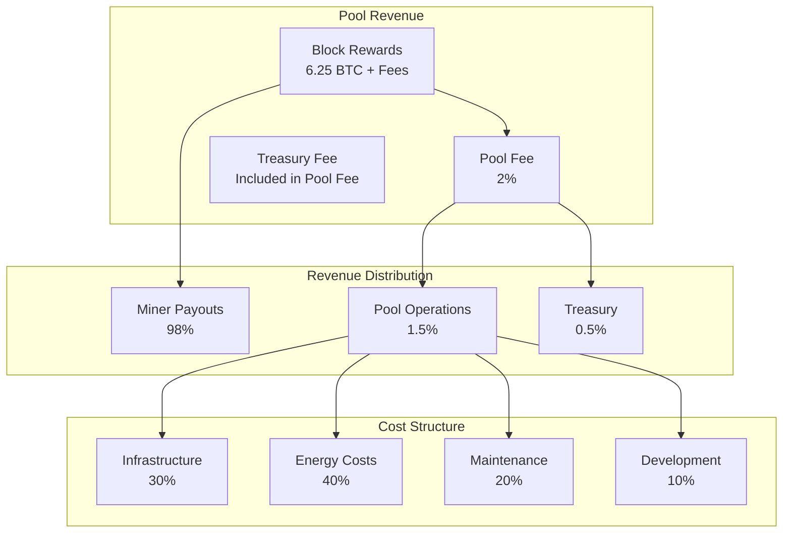

# Mining Pool Economics

Understanding the economics of Bitcoin mining pools is crucial for sustainable operations and fair miner compensation within the BLGV ecosystem.

## 💰 **Pool Economic Model**

### Revenue Streams


### BLGV Pool Economics
- **Pool Fee**: 2% (competitive with major pools)
- **Payout Method**: PPLNS (Pay Per Last N Shares)
- **Minimum Payout**: 0.001 BTC
- **Payment Methods**: Lightning Network, On-chain
- **Treasury Integration**: Direct BTC accumulation

## 📊 **Payout Models**

### PPLNS (Pay Per Last N Shares)
BLGV uses PPLNS to ensure fair distribution while discouraging pool hopping.

```typescript
interface PPLNSCalculation {
  windowSize: number;        // N shares to consider
  sharesDifficulty: number;  // Total difficulty of shares
  blockReward: number;       // Current block reward
  poolFee: number;          // Pool fee percentage
}

class PPLNSCalculator {
  async calculatePayouts(block: Block): Promise<PayoutDistribution> {
    const windowShares = await this.getRecentShares(this.windowSize);
    const totalDifficulty = windowShares.reduce((sum, share) => sum + share.difficulty, 0);
    
    if (totalDifficulty === 0) {
      return { payouts: {}, totalPaid: 0 };
    }
    
    const netReward = block.reward * (1 - this.poolFee / 100);
    const payouts: Record<string, number> = {};
    
    // Group shares by miner
    const minerShares = this.groupSharesByMiner(windowShares);
    
    for (const [minerAddress, shares] of Object.entries(minerShares)) {
      const minerDifficulty = shares.reduce((sum, share) => sum + share.difficulty, 0);
      const minerPortion = minerDifficulty / totalDifficulty;
      const payout = netReward * minerPortion;
      
      if (payout >= this.minimumPayout) {
        payouts[minerAddress] = payout;
      } else {
        // Accumulate small payouts
        await this.accumulatePayout(minerAddress, payout);
      }
    }
    
    return {
      payouts,
      totalPaid: Object.values(payouts).reduce((sum, amount) => sum + amount, 0),
      blockHash: block.hash,
      blockHeight: block.height,
      timestamp: block.timestamp
    };
  }
  
  private async getRecentShares(count: number): Promise<Share[]> {
    // Get last N shares based on difficulty, not count
    return await this.database.query(`
      SELECT * FROM shares 
      WHERE timestamp > (
        SELECT timestamp FROM (
          SELECT timestamp, 
                 SUM(difficulty) OVER (ORDER BY timestamp DESC) as cumulative_diff
          FROM shares 
          ORDER BY timestamp DESC
        ) WHERE cumulative_diff >= ?
        LIMIT 1
      )
      ORDER BY timestamp DESC
    `, [count]);
  }
}
```

### Alternative Payout Models
```typescript
// PPS (Pay Per Share) - More predictable but higher pool risk
class PPSCalculator {
  async calculatePPSPayout(share: Share): Promise<number> {
    const networkDifficulty = await this.getNetworkDifficulty();
    const blockReward = await this.getCurrentBlockReward();
    
    // Expected payout per share
    return (share.difficulty / networkDifficulty) * blockReward * (1 - this.poolFee / 100);
  }
}

// PROP (Proportional) - Simple but vulnerable to pool hopping
class ProportionalCalculator {
  async calculateProportionalPayouts(block: Block): Promise<PayoutDistribution> {
    const roundShares = await this.getRoundShares(block.previousHash);
    const totalDifficulty = roundShares.reduce((sum, share) => sum + share.difficulty, 0);
    const netReward = block.reward * (1 - this.poolFee / 100);
    
    const payouts: Record<string, number> = {};
    const minerShares = this.groupSharesByMiner(roundShares);
    
    for (const [minerAddress, shares] of Object.entries(minerShares)) {
      const minerDifficulty = shares.reduce((sum, share) => sum + share.difficulty, 0);
      payouts[minerAddress] = (minerDifficulty / totalDifficulty) * netReward;
    }
    
    return { payouts, totalPaid: netReward };
  }
}
```

## ⚡ **Lightning Network Economics**

### Instant Payout Benefits
```typescript
class LightningPayoutEconomics {
  async calculateLightningBenefits(): Promise<LightningBenefits> {
    const onchainFee = await this.getOnchainFeeRate();
    const lightningFee = 0.001; // 0.1% Lightning fee
    
    const breakEvenAmount = onchainFee / lightningFee;
    
    return {
      breakEvenAmount,
      costSavings: this.calculateCostSavings(onchainFee, lightningFee),
      speedAdvantage: '~1 second vs ~10 minutes',
      minerSatisfaction: this.calculateSatisfactionIndex(),
      poolCompetitiveness: this.assessCompetitiveAdvantage()
    };
  }
  
  private calculateCostSavings(onchainFee: number, lightningFee: number): CostSavings {
    const avgPayoutSize = 0.01; // 0.01 BTC average
    
    return {
      onchainCost: onchainFee,
      lightningCost: avgPayoutSize * lightningFee,
      savingsPerPayout: onchainFee - (avgPayoutSize * lightningFee),
      monthlySavings: this.calculateMonthlySavings(onchainFee, lightningFee)
    };
  }
  
  async optimizeLightningChannels(): Promise<ChannelOptimization> {
    const payoutVolume = await this.getMonthlyPayoutVolume();
    const avgPayoutSize = await this.getAveragePayoutSize();
    
    const recommendedCapacity = payoutVolume * 1.5; // 50% buffer
    const recommendedChannels = Math.ceil(recommendedCapacity / 0.1); // 0.1 BTC per channel
    
    return {
      recommendedCapacity,
      recommendedChannels,
      liquidityRequirements: this.calculateLiquidityRequirements(payoutVolume),
      rebalancingStrategy: this.designRebalancingStrategy()
    };
  }
}
```

### Lightning Channel Strategy for Mining Pools
```typescript
class PoolLightningStrategy {
  async designChannelStrategy(): Promise<ChannelStrategy> {
    // Analyze miner payment patterns
    const paymentPatterns = await this.analyzePaymentPatterns();
    
    return {
      channelTypes: {
        // High-volume miners (direct channels)
        directChannels: {
          targets: paymentPatterns.highVolumeMiners,
          capacity: 0.1, // 0.1 BTC per channel
          count: paymentPatterns.highVolumeMiners.length
        },
        
        // General routing (through major nodes)
        routingChannels: {
          targets: ['LOOP', 'WalletOfSatoshi', 'LNBig'],
          capacity: 0.5, // 0.5 BTC per channel
          count: 5
        },
        
        // Lightning service providers
        lspChannels: {
          targets: ['Voltage', 'Magma', 'ACINQ'],
          capacity: 0.2, // 0.2 BTC per channel
          count: 3
        }
      },
      
      totalCapacity: this.calculateTotalCapacity(),
      rebalancingBudget: this.calculateRebalancingBudget(),
      expectedSavings: this.calculateExpectedSavings()
    };
  }
  
  private async analyzePaymentPatterns(): Promise<PaymentPatterns> {
    const lastMonthPayouts = await this.getPayouts(30);
    
    return {
      totalVolume: lastMonthPayouts.reduce((sum, p) => sum + p.amount, 0),
      averageSize: lastMonthPayouts.reduce((sum, p) => sum + p.amount, 0) / lastMonthPayouts.length,
      paymentFrequency: lastMonthPayouts.length / 30, // per day
      highVolumeMiners: this.identifyHighVolumeMiners(lastMonthPayouts),
      peakTimes: this.identifyPeakPaymentTimes(lastMonthPayouts)
    };
  }
}
```

## 🏗️ **Pool Infrastructure Economics**

### Cost-Benefit Analysis
```typescript
interface InfrastructureCosts {
  servers: number;           // Monthly server costs
  bandwidth: number;         // Bandwidth costs
  electricity: number;       // Electricity costs
  maintenance: number;       // Maintenance costs
  development: number;       // Development costs
  compliance: number;        // Legal and compliance
}

class InfrastructureOptimizer {
  async optimizeInfrastructure(targetHashrate: number): Promise<InfrastructureRecommendation> {
    const currentCosts = await this.getCurrentCosts();
    const efficiency = await this.calculateEfficiency(targetHashrate);
    
    return {
      recommendedServers: this.calculateServerRequirements(targetHashrate),
      bandwidthRequirements: this.calculateBandwidthNeeds(targetHashrate),
      redundancyLevel: this.calculateRedundancyNeeds(targetHashrate),
      totalMonthlyCost: this.calculateTotalCosts(efficiency),
      costPerHashrate: this.calculateCostEfficiency(efficiency),
      scalingPlan: this.designScalingPlan(targetHashrate)
    };
  }
  
  private calculateServerRequirements(hashrate: number): ServerRequirements {
    // Each server can handle ~1000 concurrent connections
    // Each connection represents ~100 TH/s average
    const connectionsNeeded = hashrate / 100_000_000_000_000; // 100 TH/s in H/s
    const serversNeeded = Math.ceil(connectionsNeeded / 1000);
    
    return {
      primaryServers: serversNeeded,
      backupServers: Math.ceil(serversNeeded * 0.5), // 50% redundancy
      loadBalancers: Math.ceil(serversNeeded / 5), // 1 LB per 5 servers
      totalCost: this.calculateServerCosts(serversNeeded)
    };
  }
  
  async calculateROI(investment: number, expectedHashrate: number): Promise<ROIAnalysis> {
    const monthlyRevenue = await this.estimateMonthlyRevenue(expectedHashrate);
    const monthlyCosts = await this.estimateMonthlyCosts(expectedHashrate);
    const monthlyProfit = monthlyRevenue - monthlyCosts;
    
    const paybackPeriod = investment / monthlyProfit;
    const annualROI = (monthlyProfit * 12) / investment;
    
    return {
      monthlyRevenue,
      monthlyCosts,
      monthlyProfit,
      paybackPeriod,
      annualROI,
      breakEvenHashrate: this.calculateBreakEvenHashrate(),
      riskFactors: this.assessRiskFactors()
    };
  }
}
```

### Energy Cost Optimization
```typescript
class EnergyOptimizer {
  async optimizeEnergyCosts(): Promise<EnergyStrategy> {
    const currentUsage = await this.getCurrentEnergyUsage();
    const costs = await this.getEnergyCosts();
    
    return {
      renewableTransition: {
        solarCapacity: this.calculateSolarRequirements(currentUsage),
        windCapacity: this.calculateWindRequirements(currentUsage),
        batteryStorage: this.calculateStorageRequirements(),
        paybackPeriod: this.calculateRenewablePayback(),
        environmentalImpact: this.calculateCarbonReduction()
      },
      
      timeOfUseOptimization: {
        peakHours: costs.peakHours,
        offPeakHours: costs.offPeakHours,
        demandResponse: this.designDemandResponseStrategy(),
        potentialSavings: this.calculateTimeOfUseSavings()
      },
      
      efficiency: {
        currentPUE: currentUsage.pue, // Power Usage Effectiveness
        targetPUE: 1.2, // Industry best practice
        coolingOptimization: this.designCoolingStrategy(),
        hardwareUpgrades: this.recommendHardwareUpgrades()
      }
    };
  }
  
  private calculateRenewablePayback(): PaybackAnalysis {
    const renewableCosts = this.getRenewableInstallationCosts();
    const currentEnergyCosts = this.getCurrentEnergyCosts();
    const renewableEnergyCosts = this.getRenewableOperatingCosts();
    
    const annualSavings = currentEnergyCosts - renewableEnergyCosts;
    const paybackYears = renewableCosts.initial / annualSavings;
    
    return {
      initialInvestment: renewableCosts.initial,
      annualSavings,
      paybackYears,
      twentyYearNPV: this.calculateNPV(annualSavings, 20),
      carbonCredits: this.calculateCarbonCredits(),
      publicRelationsValue: this.assessPRValue()
    };
  }
}
```

## 💡 **Profitability Optimization**

### Dynamic Fee Adjustment
```typescript
class DynamicFeeManager {
  async optimizePoolFees(): Promise<FeeOptimization> {
    const marketConditions = await this.analyzeMarketConditions();
    const competitorAnalysis = await this.analyzeCompetitors();
    const minerSensitivity = await this.analyzeMinerFeeSensitivity();
    
    return {
      currentFee: this.currentFeeRate,
      recommendedFee: this.calculateOptimalFee(marketConditions, competitorAnalysis, minerSensitivity),
      expectedImpact: this.calculateFeeChangeImpact(),
      implementationPlan: this.designFeeTransition(),
      monitoring: this.designFeeMonitoring()
    };
  }
  
  private calculateOptimalFee(
    market: MarketConditions,
    competitors: CompetitorAnalysis,
    sensitivity: FeeSensitivity
  ): number {
    let optimalFee = 2.0; // Base 2% fee
    
    // Market conditions adjustment
    if (market.networkDifficulty.trend === 'increasing') {
      optimalFee -= 0.1; // More competitive when difficulty rising
    }
    
    if (market.bitcoinPrice.volatility > 0.1) {
      optimalFee += 0.1; // Slightly higher fee during high volatility
    }
    
    // Competitive adjustment
    const avgCompetitorFee = competitors.averageFee;
    if (optimalFee > avgCompetitorFee + 0.5) {
      optimalFee = avgCompetitorFee + 0.3; // Stay competitive
    }
    
    // Miner sensitivity adjustment
    if (sensitivity.elasticity > 2.0) { // High sensitivity
      optimalFee = Math.min(optimalFee, avgCompetitorFee);
    }
    
    return Math.max(1.0, Math.min(3.0, optimalFee)); // 1-3% range
  }
  
  async calculateFeeChangeImpact(): Promise<FeeImpact> {
    const currentMiners = await this.getCurrentMinerCount();
    const historicalData = await this.getHistoricalFeeChanges();
    
    return {
      expectedMinerRetention: this.calculateRetentionRate(historicalData),
      revenueImpact: this.calculateRevenueChange(),
      competitivePosition: this.assessCompetitiveImpact(),
      minerAcquisition: this.estimateNewMinerAcquisition(),
      timeToEquilibrium: this.estimateAdjustmentPeriod()
    };
  }
}
```

### Treasury Integration Benefits
```typescript
class TreasuryIntegrationEconomics {
  async calculateTreasuryBenefits(): Promise<TreasuryBenefits> {
    const poolContribution = await this.calculatePoolContribution();
    const treasuryGrowth = await this.calculateTreasuryGrowth();
    
    return {
      btcAccumulation: {
        monthlyAccumulation: poolContribution.monthly,
        annualAccumulation: poolContribution.annual,
        compoundGrowth: this.calculateCompoundGrowth(),
        btcPerShareImpact: this.calculateBTCPerShareImpact()
      },
      
      strategicAdvantages: {
        verticalIntegration: this.assessVerticalIntegration(),
        marketPosition: this.assessMarketPosition(),
        riskDiversification: this.assessRiskDiversification(),
        synergies: this.calculateSynergies()
      },
      
      operationalBenefits: {
        sharedInfrastructure: this.calculateInfrastructureSavings(),
        crossPlatformUsers: this.calculateUserSynergies(),
        brandStrength: this.assessBrandBenefits(),
        regulatoryAdvantage: this.assessRegulatoryBenefits()
      }
    };
  }
  
  private calculatePoolContribution(): PoolContribution {
    const estimatedHashrate = 100_000_000_000_000; // 100 TH/s target
    const networkHashrate = 350_000_000_000_000_000; // Current network ~350 EH/s
    const poolShare = estimatedHashrate / networkHashrate;
    
    const dailyBitcoinIssuance = 144 * 6.25; // 900 BTC per day
    const poolDailyRevenue = dailyBitcoinIssuance * poolShare;
    const poolFeeRevenue = poolDailyRevenue * 0.02; // 2% fee
    
    return {
      daily: poolFeeRevenue,
      monthly: poolFeeRevenue * 30,
      annual: poolFeeRevenue * 365,
      btcPerShareContribution: this.calculateBTCPerShareContribution(poolFeeRevenue)
    };
  }
}
```

## 📈 **Performance Metrics**

### Key Performance Indicators
```typescript
interface PoolKPIs {
  // Financial KPIs
  monthlyRevenue: number;
  profitMargin: number;
  costPerHashrate: number;
  revenuePerMiner: number;
  
  // Operational KPIs
  uptimePercentage: number;
  averageLatency: number;
  shareAcceptanceRate: number;
  payoutAccuracy: number;
  
  // Growth KPIs
  hashrateGrowthRate: number;
  minerRetentionRate: number;
  newMinerAcquisition: number;
  marketShareGrowth: number;
  
  // Efficiency KPIs
  powerUsageEffectiveness: number;
  costOptimizationRate: number;
  automationLevel: number;
  infrastructureUtilization: number;
}

class PerformanceAnalyzer {
  async generateKPIReport(): Promise<KPIReport> {
    const currentKPIs = await this.calculateCurrentKPIs();
    const historicalTrends = await this.calculateTrends();
    const benchmarks = await this.getIndustryBenchmarks();
    
    return {
      current: currentKPIs,
      trends: historicalTrends,
      benchmarks: benchmarks,
      performanceScore: this.calculateOverallScore(currentKPIs, benchmarks),
      recommendations: this.generateRecommendations(currentKPIs, benchmarks),
      forecastNextQuarter: this.forecastPerformance(historicalTrends)
    };
  }
  
  private calculateOverallScore(current: PoolKPIs, benchmarks: PoolKPIs): number {
    const weights = {
      profitMargin: 0.25,
      uptimePercentage: 0.20,
      hashrateGrowthRate: 0.15,
      shareAcceptanceRate: 0.15,
      minerRetentionRate: 0.15,
      powerUsageEffectiveness: 0.10
    };
    
    let score = 0;
    for (const [metric, weight] of Object.entries(weights)) {
      const currentValue = current[metric as keyof PoolKPIs];
      const benchmarkValue = benchmarks[metric as keyof PoolKPIs];
      const metricScore = Math.min(100, (currentValue / benchmarkValue) * 100);
      score += metricScore * weight;
    }
    
    return Math.round(score);
  }
}
```

## 🎯 **Strategic Recommendations**

### Short-term Optimizations (0-3 months)
1. **Lightning Network Integration**
   - Implement instant payouts for miners
   - Reduce operational costs by 15-20%
   - Improve miner satisfaction and retention

2. **Fee Structure Optimization**
   - Implement dynamic fee adjustment
   - Monitor competitor pricing closely
   - Maintain 2% base fee with performance bonuses

3. **Infrastructure Efficiency**
   - Optimize server utilization
   - Implement auto-scaling for peak periods
   - Reduce energy consumption by 10%

### Medium-term Growth (3-12 months)
1. **Hashrate Expansion**
   - Target 500 TH/s total hashrate
   - Expand miner acquisition programs
   - Develop strategic partnerships

2. **Technology Enhancement**
   - Implement advanced share validation
   - Develop mobile miner monitoring app
   - Enhance real-time analytics

3. **Renewable Energy Integration**
   - Begin solar/wind installation planning
   - Explore green energy partnerships
   - Develop carbon-neutral roadmap

### Long-term Vision (1-3 years)
1. **Market Leadership**
   - Achieve top 10 pool ranking by hashrate
   - Establish BLGV as premium mining brand
   - Develop mining-as-a-service offerings

2. **Ecosystem Integration**
   - Full integration with BLGV Treasury
   - Cross-platform user benefits
   - Comprehensive Bitcoin financial services

3. **Sustainability Leadership**
   - 100% renewable energy operations
   - Carbon-negative mining operations
   - Industry sustainability standards

---

**Need help?** Check our [Mining Pool Platform](../platforms/pool.md) or reach out via [GitHub Issues](https://github.com/BlockSavvy/Unified-Treasury-System/issues). 