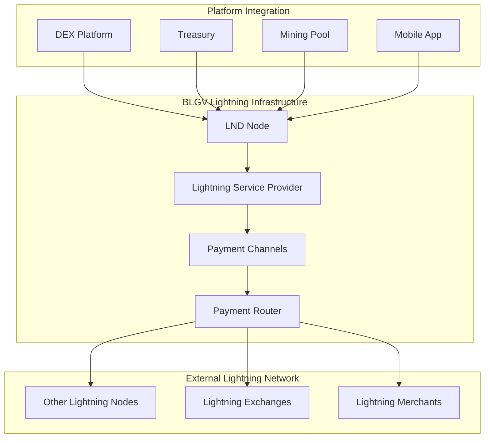

# Lightning Network Integration

The BLGV ecosystem provides comprehensive Lightning Network integration across all platforms, enabling instant Bitcoin transactions with minimal fees.

## ⚡ **Overview**

### Lightning in BLGV Ecosystem
- **DEX Platform**: Instant deposits and withdrawals
- **Treasury Management**: Lightning-enabled treasury operations
- **Mining Pool**: Instant miner payouts
- **Mobile App**: Lightning wallet functionality
- **LSP Services**: Lightning Service Provider operations

### Architecture



## 🔧 **LND Configuration**

### Production Setup
```yaml
# lnd.conf
[Application Options]
debuglevel=info
maxpendingchannels=10
alias=BLGV-Lightning-Node
color=#f7931a
listen=0.0.0.0:9735

[Bitcoin]
bitcoin.active=1
bitcoin.mainnet=1
bitcoin.node=bitcoind

[Bitcoind]
bitcoind.rpchost=localhost:8332
bitcoind.rpcuser=bitcoin
bitcoind.rpcpass=your-secure-password
bitcoind.zmqpubrawblock=tcp://127.0.0.1:28332
bitcoind.zmqpubrawtx=tcp://127.0.0.1:28333

[autopilot]
autopilot.active=1
autopilot.maxchannels=5
autopilot.allocation=0.6
```

### Regtest Configuration
```yaml
# lnd-regtest.conf
[Application Options]
debuglevel=debug
alias=BLGV-Regtest-Node

[Bitcoin]
bitcoin.active=1
bitcoin.regtest=1
bitcoin.node=bitcoind

[Bitcoind]
bitcoind.rpchost=localhost:18443
bitcoind.rpcuser=bitcoin
bitcoind.rpcpass=bitcoin
```

## 💼 **Wallet Integration**

### Lightning Wallet Operations
```typescript
interface LightningWallet {
  // Balance management
  getBalance(): Promise<LightningBalance>;
  
  // Invoice operations
  createInvoice(params: InvoiceParams): Promise<Invoice>;
  payInvoice(paymentRequest: string): Promise<Payment>;
  
  // Channel management
  openChannel(params: ChannelParams): Promise<Channel>;
  closeChannel(channelPoint: string): Promise<ChannelClose>;
  listChannels(): Promise<Channel[]>;
  
  // Payment routing
  queryRoutes(params: RouteParams): Promise<Route[]>;
  sendPayment(params: PaymentParams): Promise<Payment>;
}
```

### Example Implementation
```typescript
import { LightningService } from '@blgv/ecosystem-sdk';

const lightning = new LightningService({
  endpoint: 'https://api.blgvbtc.com/lightning',
  macaroon: 'your-macaroon',
  tlsCert: 'your-tls-cert'
});

// Create invoice for DEX deposit
const invoice = await lightning.createInvoice({
  amount: 100000, // satoshis
  description: 'DEX Trading Deposit',
  expiry: 3600 // 1 hour
});

// Pay Lightning invoice
const payment = await lightning.payInvoice(
  'lnbc1u1p3xn...' // Lightning invoice
);
```

## 🏪 **DEX Lightning Integration**

### Instant Deposits
```typescript
// Create Lightning deposit invoice
POST /api/lightning/deposit
{
  "amount": 100000,
  "description": "DEX deposit for trading"
}

// Response
{
  "success": true,
  "data": {
    "invoice": "lnbc1u1p3xn...",
    "amount": 100000,
    "expiry": 3600,
    "qrCode": "data:image/png;base64,..."
  }
}
```

### Instant Withdrawals
```typescript
// Withdraw via Lightning
POST /api/lightning/withdraw
{
  "invoice": "lnbc500u1p3xn...",
  "amount": 50000
}

// Response
{
  "success": true,
  "data": {
    "paymentHash": "a1b2c3...",
    "status": "pending",
    "fee": 100,
    "route": [....]
  }
}
```

## ⛏️ **Mining Pool Lightning Payouts**

### Instant Miner Payments
```typescript
// Configure Lightning payout
const payoutConfig = {
  method: 'lightning',
  threshold: 10000, // 10k satoshis minimum
  invoice: 'lnbc100u1p3xn...', // Recurring invoice
  frequency: 'daily'
};

// Automatic Lightning payouts
class LightningPayoutService {
  async processPayout(miner: Miner, amount: number) {
    if (amount >= this.threshold) {
      const invoice = await this.generateInvoice(miner, amount);
      const payment = await this.lightning.payInvoice(invoice);
      
      await this.recordPayout({
        minerId: miner.id,
        amount,
        paymentHash: payment.hash,
        method: 'lightning'
      });
    }
  }
}
```

## 🏦 **Treasury Lightning Operations**

### Lightning-Enabled Treasury
```typescript
// Treasury Lightning integration
class TreasuryLightning {
  async executeLightningPurchase(amount: number) {
    // Create invoice for Bitcoin purchase
    const invoice = await this.lightning.createInvoice({
      amount: amount * 100000000, // Convert to satoshis
      description: 'Treasury Bitcoin Purchase'
    });
    
    // Execute purchase via Lightning
    const purchase = await this.executeInstantPurchase(invoice);
    
    return {
      txid: purchase.paymentHash,
      amount,
      method: 'lightning',
      fee: purchase.fee,
      timestamp: new Date().toISOString()
    };
  }
}
```

## 📱 **Mobile Lightning Wallet**

### React Native Lightning Integration
```typescript
// Mobile Lightning wallet
import { LightningModule } from '@blgv/mobile-lightning';

const MobileLightningWallet = () => {
  const [balance, setBalance] = useState(0);
  const [invoice, setInvoice] = useState('');
  
  const createInvoice = async (amount: number) => {
    try {
      const result = await LightningModule.createInvoice({
        amount,
        description: 'Mobile wallet payment'
      });
      setInvoice(result.invoice);
    } catch (error) {
      console.error('Invoice creation failed:', error);
    }
  };
  
  const payInvoice = async (paymentRequest: string) => {
    try {
      const payment = await LightningModule.payInvoice(paymentRequest);
      updateBalance();
      return payment;
    } catch (error) {
      console.error('Payment failed:', error);
    }
  };
  
  return (
    <LightningWalletUI
      balance={balance}
      onCreateInvoice={createInvoice}
      onPayInvoice={payInvoice}
    />
  );
};
```

## 🛡️ **Security & Best Practices**

### Channel Management
```typescript
// Automated channel management
class ChannelManager {
  async maintainLiquidity() {
    const channels = await this.lightning.listChannels();
    
    for (const channel of channels) {
      const ratio = channel.localBalance / channel.capacity;
      
      if (ratio < 0.2) {
        // Low outbound liquidity - consider closing
        await this.evaluateChannelClose(channel);
      } else if (ratio > 0.8) {
        // High outbound liquidity - consider rebalancing
        await this.rebalanceChannel(channel);
      }
    }
  }
  
  async openStrategicChannels() {
    const targetNodes = await this.identifyTargetNodes();
    
    for (const node of targetNodes) {
      await this.lightning.openChannel({
        nodeId: node.pubkey,
        amount: this.calculateOptimalChannelSize(node),
        feeRate: this.getCurrentFeeRate()
      });
    }
  }
}
```

### Security Measures
- **Hot/Cold Wallet Separation**: Only hot funds in Lightning channels
- **Channel Backup**: Regular channel state backups
- **Monitoring**: 24/7 Lightning node monitoring
- **Fee Management**: Dynamic fee adjustment
- **Routing Optimization**: Intelligent payment routing

## 📊 **Monitoring & Analytics**

### Lightning Metrics
```typescript
interface LightningMetrics {
  totalCapacity: number;
  totalChannels: number;
  activeChannels: number;
  routingRevenue: number;
  successfulPayments: number;
  failedPayments: number;
  averagePaymentTime: number;
  networkFees: number;
}

// Lightning analytics dashboard
const getLightningAnalytics = async (): Promise<LightningMetrics> => {
  const [channels, payments, routing] = await Promise.all([
    lightning.listChannels(),
    lightning.listPayments(),
    lightning.getRoutingStats()
  ]);
  
  return {
    totalCapacity: channels.reduce((sum, ch) => sum + ch.capacity, 0),
    totalChannels: channels.length,
    activeChannels: channels.filter(ch => ch.active).length,
    routingRevenue: routing.totalRevenue,
    successfulPayments: payments.filter(p => p.status === 'SUCCEEDED').length,
    failedPayments: payments.filter(p => p.status === 'FAILED').length,
    averagePaymentTime: calculateAverageTime(payments),
    networkFees: payments.reduce((sum, p) => sum + p.fee, 0)
  };
};
```

## 🔗 **API Integration**

### Lightning API Endpoints
```typescript
// Lightning service API
class LightningAPI {
  // Invoice management
  async createInvoice(params: InvoiceParams): Promise<Invoice> {
    return this.post('/lightning/invoices', params);
  }
  
  async getInvoice(hash: string): Promise<Invoice> {
    return this.get(`/lightning/invoices/${hash}`);
  }
  
  // Payment operations
  async payInvoice(invoice: string): Promise<Payment> {
    return this.post('/lightning/payments', { invoice });
  }
  
  async getPayment(hash: string): Promise<Payment> {
    return this.get(`/lightning/payments/${hash}`);
  }
  
  // Channel management
  async listChannels(): Promise<Channel[]> {
    return this.get('/lightning/channels');
  }
  
  async openChannel(params: ChannelParams): Promise<Channel> {
    return this.post('/lightning/channels', params);
  }
}
```

## 🚀 **Development Setup**

### Local Lightning Development
```bash
# Start regtest environment with Lightning
cd regtest-ecosystem/
./start-lightning-regtest.sh

# Connect to Lightning node
lncli --network=regtest getinfo

# Create test channels
lncli --network=regtest openchannel \
  --node_key=03abc... \
  --local_amt=1000000

# Generate test invoice
lncli --network=regtest addinvoice \
  --amt=100000 \
  --memo="Test payment"
```

### Testing Lightning Integration
```typescript
// Lightning integration tests
describe('Lightning Integration', () => {
  test('should create and pay invoice', async () => {
    // Create invoice
    const invoice = await lightning.createInvoice({
      amount: 10000,
      description: 'Test payment'
    });
    
    expect(invoice.paymentRequest).toMatch(/^lnbc/);
    
    // Pay invoice
    const payment = await lightning.payInvoice(invoice.paymentRequest);
    expect(payment.status).toBe('SUCCEEDED');
  });
  
  test('should handle Lightning withdrawals', async () => {
    const withdrawal = await dex.withdrawLightning({
      invoice: 'lnbc10u1p3xn...',
      amount: 1000
    });
    
    expect(withdrawal.status).toBe('pending');
  });
});
```

## 📚 **Resources**

- [Lightning Network Specification](https://github.com/lightning/bolts)
- [LND Documentation](https://docs.lightning.engineering/)
- [BLGV Lightning Examples](../examples/lightning/)
- [Mobile Lightning Integration](../platforms/mobile.md#lightning)

---

**Need help?** Check our [Lightning Network Guide](../guides/lightning-setup.md) or reach out via [GitHub Issues](https://github.com/BlockSavvy/Unified-Treasury-System/issues). 