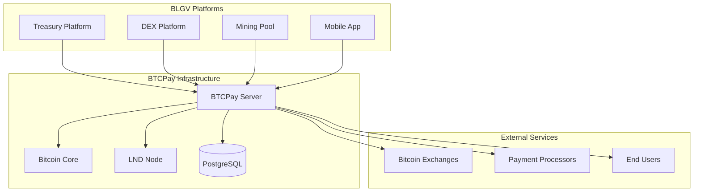

# BTCPay Server Integration

BTCPay Server serves as the backbone for Bitcoin payment processing across the BLGV ecosystem, providing enterprise-grade Bitcoin and Lightning payment infrastructure.

## 🏗️ **Architecture Overview**



## 🔧 **BTCPay Server Configuration**

### Production Setup
```yaml
# docker-compose.yml for BTCPay
version: "3.8"
services:
  btcpayserver:
    image: btcpayserver/btcpayserver:latest
    environment:
      BTCPAY_HOST: btc.gdyup.xyz
      BTCPAY_PROTOCOL: https
      BTCPAY_BIND: 0.0.0.0:49392
      BTCPAY_CHAINS: btc
      BTCPAY_BTCEXPLORERURL: https://blockstream.info
      BTCPAY_POSTGRES: "host=postgres;database=btcpayserver;username=postgres;password=${POSTGRES_PASSWORD}"
      BTCPAY_LIGHTNINGSERVICES: "type=lnd-rest;server=https://lnd:8080/;macaroonfilepath=/etc/lnd_bitcoin/data/chain/bitcoin/mainnet/admin.macaroon;certfilepath=/etc/lnd_bitcoin/tls.cert"
    volumes:
      - btcpay_datadir:/datadir
      - nbxplorer_datadir:/root/.nbxplorer
      - lnd_bitcoin_datadir:/etc/lnd_bitcoin
    ports:
      - "443:49392"
    depends_on:
      - postgres
      - bitcoind
      - lnd
```

### Regtest Configuration
```yaml
# BTCPay regtest setup
services:
  btcpayserver-regtest:
    image: btcpayserver/btcpayserver:latest
    environment:
      BTCPAY_NETWORK: regtest
      BTCPAY_BIND: 0.0.0.0:14142
      BTCPAY_CHAINS: btc
      BTCPAY_POSTGRES: "host=postgres;database=btcpayserver_regtest"
    ports:
      - "14142:14142"
```

## 🔐 **API Authentication**

### API Key Setup
```bash
# Create BTCPay store and API key
curl -X POST "https://btc.gdyup.xyz/api/v1/stores" \
  -H "Authorization: token your-btcpay-api-key" \
  -H "Content-Type: application/json" \
  -d '{
    "name": "BLGV Treasury Store",
    "website": "https://blgvbtc.com",
    "invoiceExpiration": 3600
  }'
```

### Environment Configuration
```bash
# Production BTCPay settings
BTCPAY_API_KEY=9f56512bbf4f55647213d63d740764fa990cab8f
BTCPAY_SERVER_URL=https://btc.gdyup.xyz
BTCPAY_STORE_ID=GcR3vzdWr67xPw7yFSuS7XzmKj3y5d9kUmGq9RHjmHF7

# Regtest BTCPay settings
BTCPAY_REGTEST_API_KEY=regtest-api-key
BTCPAY_REGTEST_URL=http://localhost:14142
BTCPAY_REGTEST_STORE_ID=regtest-store-id
```

## 💰 **Invoice Management**

### Creating Invoices
```typescript
import { BTCPayClient } from '@blgv/ecosystem-sdk';

const btcpay = new BTCPayClient({
  apiKey: process.env.BTCPAY_API_KEY,
  serverUrl: process.env.BTCPAY_SERVER_URL,
  storeId: process.env.BTCPAY_STORE_ID
});

// Create Bitcoin invoice
const createInvoice = async (params: InvoiceParams) => {
  const invoice = await btcpay.createInvoice({
    amount: params.amount,
    currency: 'USD',
    orderId: params.orderId,
    buyerEmail: params.email,
    notificationUrl: 'https://api.blgvbtc.com/webhooks/btcpay',
    redirectUrl: 'https://blgvbtc.com/payment/success',
    metadata: {
      platform: params.platform,
      userId: params.userId
    }
  });
  
  return {
    id: invoice.id,
    paymentUrl: `https://btc.gdyup.xyz/i/${invoice.id}`,
    bitcoinAddress: invoice.addresses.BTC,
    lightningInvoice: invoice.addresses.BTC_LightningLike,
    amount: invoice.amount,
    expiresAt: invoice.expirationTime
  };
};
```

### Lightning Integration
```typescript
// Create Lightning invoice via BTCPay
const createLightningInvoice = async (amount: number, description: string) => {
  const invoice = await btcpay.createInvoice({
    amount,
    currency: 'BTC',
    description,
    checkoutType: 'Lightning'
  });
  
  return {
    paymentRequest: invoice.addresses.BTC_LightningLike,
    paymentHash: invoice.id,
    amount: amount * 100000000, // Convert to satoshis
    expiry: 3600
  };
};
```

## 🔄 **Webhook Integration**

### Webhook Handler
```typescript
import { verifyBTCPayWebhook } from '@blgv/ecosystem-sdk';

// BTCPay webhook endpoint
app.post('/webhooks/btcpay', async (req, res) => {
  try {
    // Verify webhook signature
    const isValid = verifyBTCPayWebhook(
      req.body,
      req.headers['btcpay-sig'],
      process.env.BTCPAY_WEBHOOK_SECRET
    );
    
    if (!isValid) {
      return res.status(401).json({ error: 'Invalid signature' });
    }
    
    const { type, data } = req.body;
    
    switch (type) {
      case 'InvoiceReceivedPayment':
        await handlePaymentReceived(data);
        break;
        
      case 'InvoiceSettled':
        await handlePaymentSettled(data);
        break;
        
      case 'InvoiceExpired':
        await handlePaymentExpired(data);
        break;
        
      case 'InvoiceInvalid':
        await handlePaymentInvalid(data);
        break;
    }
    
    res.status(200).json({ received: true });
  } catch (error) {
    console.error('BTCPay webhook error:', error);
    res.status(500).json({ error: 'Webhook processing failed' });
  }
});
```

### Payment Processing
```typescript
// Handle successful payment
const handlePaymentSettled = async (invoiceData: any) => {
  const { invoiceId, storeId, amount, orderId, metadata } = invoiceData;
  
  // Update platform based on metadata
  switch (metadata.platform) {
    case 'treasury':
      await processTreasuryPayment({
        invoiceId,
        amount,
        userId: metadata.userId
      });
      break;
      
    case 'dex':
      await processDEXDeposit({
        invoiceId,
        amount,
        userId: metadata.userId
      });
      break;
      
    case 'pool':
      await processPoolPayment({
        invoiceId,
        amount,
        minerId: metadata.userId
      });
      break;
  }
  
  // Send confirmation
  await sendPaymentConfirmation(metadata.userId, {
    invoiceId,
    amount,
    platform: metadata.platform
  });
};
```

## 🏪 **Store Configuration**

### Multi-Store Setup
```typescript
// Configure stores for different platforms
const storeConfigs = {
  treasury: {
    name: 'BLGV Treasury',
    storeId: 'GcR3vzdWr67xPw7yFSuS7XzmKj3y5d9kUmGq9RHjmHF7',
    defaultCurrency: 'USD',
    invoiceExpiration: 3600,
    paymentTolerance: 0.01
  },
  
  dex: {
    name: 'BLGV DEX',
    storeId: 'DEX_STORE_ID',
    defaultCurrency: 'BTC',
    invoiceExpiration: 1800,
    lightningOnly: true
  },
  
  pool: {
    name: 'BLGV Mining Pool',
    storeId: 'POOL_STORE_ID',
    defaultCurrency: 'BTC',
    invoiceExpiration: 7200,
    minimumAmount: 0.001
  }
};

// Initialize BTCPay clients for each store
const btcpayClients = Object.entries(storeConfigs).reduce((clients, [platform, config]) => {
  clients[platform] = new BTCPayClient({
    apiKey: process.env.BTCPAY_API_KEY,
    serverUrl: process.env.BTCPAY_SERVER_URL,
    storeId: config.storeId
  });
  return clients;
}, {} as Record<string, BTCPayClient>);
```

## 📊 **Payment Analytics**

### Transaction Tracking
```typescript
// Get payment statistics
const getPaymentStats = async (storeId: string, period: string) => {
  const invoices = await btcpay.getInvoices({
    storeId,
    startDate: getStartDate(period),
    endDate: new Date().toISOString(),
    status: ['Settled']
  });
  
  const stats = invoices.reduce((acc, invoice) => {
    acc.totalAmount += invoice.amount;
    acc.totalCount += 1;
    
    if (invoice.paymentMethod === 'BTC') {
      acc.onchainCount += 1;
      acc.onchainAmount += invoice.amount;
    } else if (invoice.paymentMethod === 'BTC_LightningLike') {
      acc.lightningCount += 1;
      acc.lightningAmount += invoice.amount;
    }
    
    return acc;
  }, {
    totalAmount: 0,
    totalCount: 0,
    onchainCount: 0,
    onchainAmount: 0,
    lightningCount: 0,
    lightningAmount: 0
  });
  
  return {
    ...stats,
    averageAmount: stats.totalAmount / stats.totalCount,
    lightningPercentage: (stats.lightningCount / stats.totalCount) * 100
  };
};
```

### Revenue Reporting
```typescript
// Generate revenue report
const generateRevenueReport = async (period: 'daily' | 'weekly' | 'monthly') => {
  const reports = await Promise.all(
    Object.entries(storeConfigs).map(async ([platform, config]) => {
      const stats = await getPaymentStats(config.storeId, period);
      return {
        platform,
        ...stats
      };
    })
  );
  
  return {
    period,
    timestamp: new Date().toISOString(),
    platforms: reports,
    total: reports.reduce((sum, report) => sum + report.totalAmount, 0)
  };
};
```

## ⚡ **Lightning Network Integration**

### Lightning Setup
```typescript
// Configure Lightning with BTCPay
const lightningConfig = {
  type: 'lnd-rest',
  server: 'https://lnd:8080/',
  macaroonPath: '/etc/lnd_bitcoin/data/chain/bitcoin/mainnet/admin.macaroon',
  certPath: '/etc/lnd_bitcoin/tls.cert'
};

// Lightning invoice creation
const createLightningOnly = async (amount: number, description: string) => {
  return await btcpay.createInvoice({
    amount,
    currency: 'BTC',
    description,
    paymentMethods: ['BTC_LightningLike'],
    speedPolicy: 'HighSpeed',
    metadata: {
      lightning_only: true
    }
  });
};
```

## 🔒 **Security Configuration**

### API Security
```typescript
// BTCPay API security headers
const btcpaySecurityConfig = {
  apiKey: process.env.BTCPAY_API_KEY,
  webhookSecret: process.env.BTCPAY_WEBHOOK_SECRET,
  allowedIPs: [
    '159.203.48.225', // BTCPay server IP
    '10.0.0.0/8'      // Internal network
  ],
  rateLimiting: {
    windowMs: 15 * 60 * 1000, // 15 minutes
    max: 100 // limit each IP to 100 requests per windowMs
  }
};

// Webhook signature verification
const verifyWebhookSignature = (payload: string, signature: string, secret: string): boolean => {
  const hmac = crypto.createHmac('sha256', secret);
  hmac.update(payload);
  const expectedSignature = hmac.digest('hex');
  return crypto.timingSafeEqual(
    Buffer.from(signature, 'hex'),
    Buffer.from(expectedSignature, 'hex')
  );
};
```

## 🚀 **Development & Testing**

### Regtest Integration
```bash
# Start BTCPay regtest environment
docker-compose -f docker-compose.regtest.yml up -d

# Create regtest store
curl -X POST "http://localhost:14142/api/v1/stores" \
  -H "Authorization: token regtest-api-key" \
  -d '{
    "name": "BLGV Regtest Store",
    "defaultCurrency": "BTC"
  }'

# Test invoice creation
curl -X POST "http://localhost:14142/api/v1/stores/STORE_ID/invoices" \
  -H "Authorization: token regtest-api-key" \
  -d '{
    "amount": 0.001,
    "currency": "BTC",
    "orderId": "test-001"
  }'
```

### Integration Testing
```typescript
// BTCPay integration tests
describe('BTCPay Integration', () => {
  test('should create invoice successfully', async () => {
    const invoice = await btcpay.createInvoice({
      amount: 100,
      currency: 'USD',
      orderId: 'test-' + Date.now()
    });
    
    expect(invoice.id).toBeDefined();
    expect(invoice.addresses.BTC).toMatch(/^(bc1|3)/);
  });
  
  test('should handle Lightning invoices', async () => {
    const invoice = await createLightningOnly(0.001, 'Test payment');
    expect(invoice.addresses.BTC_LightningLike).toMatch(/^lnbc/);
  });
  
  test('should process webhook correctly', async () => {
    const webhookData = {
      type: 'InvoiceSettled',
      data: {
        invoiceId: 'test-invoice',
        amount: 100,
        metadata: { platform: 'treasury', userId: 'user123' }
      }
    };
    
    const response = await request(app)
      .post('/webhooks/btcpay')
      .send(webhookData)
      .expect(200);
      
    expect(response.body.received).toBe(true);
  });
});
```

## 📚 **API Reference**

### Core Methods
```typescript
interface BTCPayClient {
  // Invoice operations
  createInvoice(params: InvoiceParams): Promise<Invoice>;
  getInvoice(invoiceId: string): Promise<Invoice>;
  updateInvoice(invoiceId: string, updates: Partial<Invoice>): Promise<Invoice>;
  
  // Store management
  getStores(): Promise<Store[]>;
  getStore(storeId: string): Promise<Store>;
  updateStore(storeId: string, updates: Partial<Store>): Promise<Store>;
  
  // Payment methods
  getPaymentMethods(storeId: string): Promise<PaymentMethod[]>;
  updatePaymentMethod(storeId: string, method: PaymentMethod): Promise<void>;
  
  // Lightning operations
  createLightningInvoice(params: LightningParams): Promise<LightningInvoice>;
  payLightningInvoice(invoice: string): Promise<LightningPayment>;
  
  // Reporting
  getInvoices(params: InvoiceQuery): Promise<Invoice[]>;
  getPayments(params: PaymentQuery): Promise<Payment[]>;
}
```

## 📖 **Resources**

- [BTCPay Server Documentation](https://docs.btcpayserver.org/)
- [BTCPay API Reference](https://docs.btcpayserver.org/API/Greenfield/v1/)
- [BLGV BTCPay Examples](../examples/btcpay/)
- [Lightning Integration Guide](../lightning/integration.md)

---

**Need help?** Check our [Payment Processing Guide](../guides/payments.md) or reach out via [GitHub Issues](https://github.com/BlockSavvy/Unified-Treasury-System/issues). 