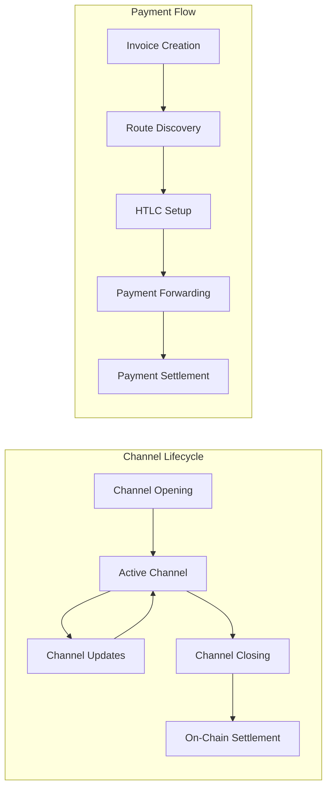

# Lightning Network Protocol

BLGV's Lightning Network implementation follows the Lightning Network specification (BOLTs) with enterprise-grade enhancements for treasury management and high-volume operations.

## ⚡ **Protocol Overview**

### Lightning Network Basics
The Lightning Network is a second-layer payment protocol that operates on top of Bitcoin, enabling instant and low-cost transactions through bidirectional payment channels.



### BLGV Lightning Implementation
- **LND-based**: Built on Lightning Network Daemon (LND)
- **Multi-platform**: Integrated across Treasury, DEX, Pool, and Mobile
- **Enterprise features**: Advanced channel management and monitoring
- **High availability**: Redundant node setup with failover

## 🔧 **Protocol Configuration**

### LND Configuration
```yaml
# Production LND configuration
[Application Options]
debuglevel=info
maxpendingchannels=50
alias=BLGV-Enterprise-Node
color=#f7931a
listen=0.0.0.0:9735
externalhosts=lightning.blgvbtc.com
nat=false

[Bitcoin]
bitcoin.active=1
bitcoin.mainnet=1
bitcoin.node=bitcoind

[Bitcoind]
bitcoind.rpchost=bitcoin-core:8332
bitcoind.rpcuser=bitcoin
bitcoind.rpcpass=${BITCOIN_RPC_PASSWORD}
bitcoind.zmqpubrawblock=tcp://bitcoin-core:28332
bitcoind.zmqpubrawtx=tcp://bitcoin-core:28333

[autopilot]
autopilot.active=1
autopilot.maxchannels=20
autopilot.allocation=0.6
autopilot.minchansize=1000000
autopilot.maxchansize=100000000

[watchtower]
watchtower.active=1

[wtclient]
wtclient.active=1
```

### Channel Management Policy
```typescript
interface ChannelPolicy {
  minChannelSize: number;     // 0.01 BTC minimum
  maxChannelSize: number;     // 1.0 BTC maximum
  targetChannels: number;     // 20 active channels
  liquidityRatio: number;     // 60% outbound liquidity target
  feeRate: number;           // Dynamic fee adjustment
  csvDelay: number;          // 144 blocks
  dustLimit: number;         // 354 satoshis
}

const blgvChannelPolicy: ChannelPolicy = {
  minChannelSize: 1000000,     // 0.01 BTC
  maxChannelSize: 100000000,   // 1.0 BTC
  targetChannels: 20,
  liquidityRatio: 0.6,
  feeRate: 1000,              // 1000 milli-satoshis per sat
  csvDelay: 144,
  dustLimit: 354
};
```

## 🔐 **Security Implementation**

### Key Management
```typescript
// Hierarchical Deterministic key derivation
interface LightningKeyManager {
  // Master keys (hardware security module)
  masterSeed: Buffer;
  
  // Derived keys for different purposes
  nodeKey: PrivateKey;        // Node identity
  channelKeys: ChannelKeys[]; // Per-channel keys
  invoiceKeys: InvoiceKeys[]; // Invoice generation
  
  // Key rotation
  rotateKeys(keyType: KeyType): Promise<void>;
  
  // Backup and recovery
  exportBackup(): ChannelBackup[];
  importBackup(backup: ChannelBackup[]): Promise<void>;
}

// Channel state backup
interface ChannelBackup {
  channelPoint: string;
  localBalance: number;
  remoteBalance: number;
  commitmentHeight: number;
  revocationKey: Buffer;
  paymentPreimage: Buffer[];
}
```

### Watchtower Integration
```typescript
// Watchtower client configuration
const watchtowerConfig = {
  towers: [
    'tower1.blgvbtc.com:9911',
    'tower2.blgvbtc.com:9911',
    'tower3.blgvbtc.com:9911'
  ],
  maxUpdates: 1000,
  sweepFeeRate: 10, // sat/vbyte
  autoBackup: true,
  encryptionKey: process.env.WATCHTOWER_ENCRYPTION_KEY
};

// Automatic channel backup to watchtowers
class WatchtowerManager {
  async backupChannelState(channel: Channel) {
    const backup = await this.createBackup(channel);
    
    // Upload to multiple watchtowers
    const promises = this.watchtowers.map(tower => 
      tower.uploadBackup(backup)
    );
    
    await Promise.all(promises);
  }
  
  async monitorChannels() {
    const channels = await this.lnd.listChannels();
    
    for (const channel of channels) {
      if (channel.commitmentUpdated) {
        await this.backupChannelState(channel);
      }
    }
  }
}
```

## 💰 **Payment Protocol**

### Invoice Creation
```typescript
interface LightningInvoice {
  paymentRequest: string;     // BOLT-11 encoded invoice
  paymentHash: Buffer;        // SHA256 hash
  amount: number;            // Satoshis
  description: string;       // Payment description
  expiry: number;           // Seconds until expiry
  routeHints: RouteHint[];  // Private channel hints
  fallbackAddress?: string; // On-chain fallback
}

// Create invoice with route hints
const createInvoice = async (params: InvoiceParams): Promise<LightningInvoice> => {
  const invoice = await lnd.addInvoice({
    memo: params.description,
    value: params.amount,
    expiry: params.expiry || 3600,
    private: params.includeRouteHints,
    fallbackAddr: params.fallbackAddress
  });
  
  return {
    paymentRequest: invoice.paymentRequest,
    paymentHash: Buffer.from(invoice.rHash, 'hex'),
    amount: params.amount,
    description: params.description,
    expiry: params.expiry || 3600,
    routeHints: await generateRouteHints(),
    fallbackAddress: params.fallbackAddress
  };
};
```

### Payment Routing
```typescript
// Advanced routing with fee optimization
interface PaymentRoute {
  totalAmount: number;      // Total amount including fees
  totalFees: number;        // Total routing fees
  totalTimelock: number;    // Total timelock
  hops: RouteHop[];        // Individual hops
  probability: number;      // Success probability
}

class LightningRouter {
  async findOptimalRoute(
    destination: string,
    amount: number,
    maxFee: number
  ): Promise<PaymentRoute[]> {
    // Query multiple routes
    const routes = await this.lnd.queryRoutes({
      pubKey: destination,
      amt: amount,
      feeLimit: { fixed: maxFee },
      numRoutes: 10
    });
    
    // Score routes by fee and probability
    return routes.routes
      .map(route => ({
        ...route,
        probability: this.calculateSuccessProbability(route)
      }))
      .sort((a, b) => {
        const scoreA = this.calculateRouteScore(a);
        const scoreB = this.calculateRouteScore(b);
        return scoreB - scoreA;
      });
  }
  
  private calculateRouteScore(route: PaymentRoute): number {
    // Weight fees vs probability vs speed
    const feeScore = 1 - (route.totalFees / route.totalAmount);
    const probScore = route.probability;
    const speedScore = 1 - (route.totalTimelock / 2016); // blocks to weeks
    
    return (feeScore * 0.4) + (probScore * 0.4) + (speedScore * 0.2);
  }
}
```

### HTLC Management
```typescript
// Hash Time Locked Contract implementation
interface HTLC {
  id: string;
  amount: number;
  hashlock: Buffer;        // Payment hash
  timelock: number;        // Expiry block height
  incoming: boolean;       // Direction
  state: HTLCState;       // Current state
}

enum HTLCState {
  PENDING = 'pending',
  SETTLED = 'settled',
  FAILED = 'failed',
  EXPIRED = 'expired'
}

class HTLCManager {
  private htlcs: Map<string, HTLC> = new Map();
  
  async addHTLC(htlc: HTLC): Promise<void> {
    this.htlcs.set(htlc.id, htlc);
    
    // Set expiry timer
    setTimeout(async () => {
      await this.expireHTLC(htlc.id);
    }, this.blocksToMs(htlc.timelock));
  }
  
  async settleHTLC(htlcId: string, preimage: Buffer): Promise<void> {
    const htlc = this.htlcs.get(htlcId);
    if (!htlc) throw new Error('HTLC not found');
    
    // Verify preimage
    const hash = crypto.createHash('sha256').update(preimage).digest();
    if (!hash.equals(htlc.hashlock)) {
      throw new Error('Invalid preimage');
    }
    
    htlc.state = HTLCState.SETTLED;
    await this.updateChannelState(htlc);
  }
  
  async failHTLC(htlcId: string, reason: string): Promise<void> {
    const htlc = this.htlcs.get(htlcId);
    if (!htlc) throw new Error('HTLC not found');
    
    htlc.state = HTLCState.FAILED;
    await this.updateChannelState(htlc);
  }
}
```

## 📡 **Network Communication**

### Peer-to-Peer Protocol
```typescript
// Lightning P2P message handling
interface LightningMessage {
  type: MessageType;
  payload: Buffer;
  signature?: Buffer;
}

enum MessageType {
  INIT = 16,
  ERROR = 17,
  PING = 18,
  PONG = 19,
  OPEN_CHANNEL = 32,
  ACCEPT_CHANNEL = 33,
  FUNDING_CREATED = 34,
  FUNDING_SIGNED = 35,
  FUNDING_LOCKED = 36,
  UPDATE_ADD_HTLC = 128,
  UPDATE_FULFILL_HTLC = 130,
  UPDATE_FAIL_HTLC = 131,
  COMMITMENT_SIGNED = 132,
  REVOKE_AND_ACK = 133
}

class LightningPeer {
  private connection: net.Socket;
  
  async sendMessage(message: LightningMessage): Promise<void> {
    const serialized = this.serializeMessage(message);
    this.connection.write(serialized);
  }
  
  async handleMessage(message: LightningMessage): Promise<void> {
    switch (message.type) {
      case MessageType.UPDATE_ADD_HTLC:
        await this.handleAddHTLC(message);
        break;
        
      case MessageType.UPDATE_FULFILL_HTLC:
        await this.handleFulfillHTLC(message);
        break;
        
      case MessageType.COMMITMENT_SIGNED:
        await this.handleCommitmentSigned(message);
        break;
        
      default:
        console.warn(`Unknown message type: ${message.type}`);
    }
  }
}
```

### Gossip Protocol
```typescript
// Network topology discovery
interface NodeAnnouncement {
  nodeId: Buffer;
  alias: string;
  color: string;
  addresses: NetworkAddress[];
  features: FeatureBits;
  timestamp: number;
  signature: Buffer;
}

interface ChannelAnnouncement {
  channelId: string;
  nodeId1: Buffer;
  nodeId2: Buffer;
  features: FeatureBits;
  fundingTxid: string;
  fundingOutputIndex: number;
  signature1: Buffer;
  signature2: Buffer;
}

class GossipManager {
  private networkGraph: Map<string, ChannelAnnouncement> = new Map();
  
  async processChannelAnnouncement(announcement: ChannelAnnouncement): Promise<void> {
    // Verify signatures
    if (!this.verifyChannelAnnouncement(announcement)) {
      throw new Error('Invalid channel announcement');
    }
    
    // Update network graph
    this.networkGraph.set(announcement.channelId, announcement);
    
    // Broadcast to peers
    await this.broadcastAnnouncement(announcement);
  }
  
  async getNetworkTopology(): Promise<NetworkTopology> {
    return {
      nodes: Array.from(this.nodes.values()),
      channels: Array.from(this.networkGraph.values()),
      lastUpdate: Date.now()
    };
  }
}
```

## 🔧 **Channel Operations**

### Channel Opening
```typescript
// Open Lightning channel
const openChannel = async (params: ChannelOpenParams): Promise<Channel> => {
  const fundingTx = await bitcoin.createTransaction({
    outputs: [{
      address: params.fundingAddress,
      amount: params.localAmount + params.remoteAmount
    }],
    feeRate: params.feeRate
  });
  
  const channel = await lnd.openChannelSync({
    nodePubkey: Buffer.from(params.remotePubkey, 'hex'),
    localFundingAmount: params.localAmount,
    pushSat: params.pushAmount,
    targetConf: params.confirmations || 6,
    satPerByte: params.feeRate,
    minHtlcMsat: 1000,
    remoteCsvDelay: 144,
    minConfs: 1,
    spendUnconfirmed: false
  });
  
  return {
    channelPoint: channel.fundingTxidStr,
    chanId: channel.chanId,
    active: false,
    remotePubkey: params.remotePubkey,
    capacity: params.localAmount + params.remoteAmount,
    localBalance: params.localAmount,
    remoteBalance: params.remoteAmount
  };
};
```

### Channel Closing
```typescript
// Close Lightning channel
const closeChannel = async (
  channelPoint: string,
  force: boolean = false
): Promise<ChannelClose> => {
  if (force) {
    // Force close (unilateral)
    const closeStream = lnd.closeChannel({
      channelPoint: {
        fundingTxidStr: channelPoint.split(':')[0],
        outputIndex: parseInt(channelPoint.split(':')[1])
      },
      force: true,
      targetConf: 6,
      satPerByte: 10
    });
    
    return new Promise((resolve, reject) => {
      closeStream.on('data', (response) => {
        resolve({
          type: 'force',
          txid: response.closeTxid,
          status: 'pending'
        });
      });
      
      closeStream.on('error', reject);
    });
  } else {
    // Cooperative close
    const closeStream = lnd.closeChannel({
      channelPoint: {
        fundingTxidStr: channelPoint.split(':')[0],
        outputIndex: parseInt(channelPoint.split(':')[1])
      },
      force: false,
      targetConf: 6,
      satPerByte: 1
    });
    
    return new Promise((resolve, reject) => {
      closeStream.on('data', (response) => {
        resolve({
          type: 'cooperative',
          txid: response.closeTxid,
          status: 'pending'
        });
      });
      
      closeStream.on('error', reject);
    });
  }
};
```

## 📊 **Monitoring & Analytics**

### Channel Health Monitoring
```typescript
interface ChannelHealth {
  channelId: string;
  uptime: number;           // Percentage
  successRate: number;      // Payment success rate
  liquidityRatio: number;   // Local/total balance
  feeEarnings: number;     // Routing fee earnings
  utilizationRate: number;  // Channel usage frequency
  riskScore: number;       // Computed risk score
}

class ChannelMonitor {
  async getChannelHealth(channelId: string): Promise<ChannelHealth> {
    const channel = await this.lnd.getChanInfo({ chanId: channelId });
    const payments = await this.getChannelPayments(channelId);
    
    return {
      channelId,
      uptime: this.calculateUptime(channel),
      successRate: this.calculateSuccessRate(payments),
      liquidityRatio: channel.localBalance / channel.capacity,
      feeEarnings: this.calculateFeeEarnings(payments),
      utilizationRate: this.calculateUtilization(payments),
      riskScore: this.calculateRiskScore(channel, payments)
    };
  }
  
  async rebalanceChannel(channelId: string): Promise<void> {
    const health = await this.getChannelHealth(channelId);
    
    if (health.liquidityRatio < 0.2 || health.liquidityRatio > 0.8) {
      // Channel needs rebalancing
      await this.executeRebalancing(channelId, health);
    }
  }
}
```

## 🚀 **Performance Optimization**

### Fee Management
```typescript
class FeeManager {
  async updateChannelFees(channelId: string): Promise<void> {
    const metrics = await this.getChannelMetrics(channelId);
    const marketData = await this.getMarketData();
    
    const newFeeRate = this.calculateOptimalFeeRate({
      currentVolume: metrics.volume,
      successRate: metrics.successRate,
      marketConditions: marketData,
      competitorFees: await this.getCompetitorFees(channelId)
    });
    
    await this.lnd.updateChannelPolicy({
      chanPoint: channelId,
      feeRate: newFeeRate,
      timeLockDelta: 144,
      minHtlc: 1000,
      maxHtlcMsat: 100000000000
    });
  }
  
  private calculateOptimalFeeRate(params: FeeParams): number {
    // Dynamic fee calculation based on:
    // - Network congestion
    // - Channel liquidity
    // - Historical success rates
    // - Competitor analysis
    
    const baseFee = 1000; // 1 sat base fee
    const feeRate = params.currentVolume > 1000000 ? 100 : 500; // ppm
    
    return Math.max(baseFee, feeRate);
  }
}
```

## 📚 **Resources**

- [Lightning Network BOLTs](https://github.com/lightning/bolts)
- [LND Documentation](https://docs.lightning.engineering/)
- [Lightning Network Specification](https://lightning.network/lightning-network-paper.pdf)
- [BLGV Lightning Integration](../lightning/integration.md)

---

**Need help?** Check our [Lightning Network Guide](../guides/lightning-setup.md) or reach out via [GitHub Issues](https://github.com/BlockSavvy/Unified-Treasury-System/issues). 