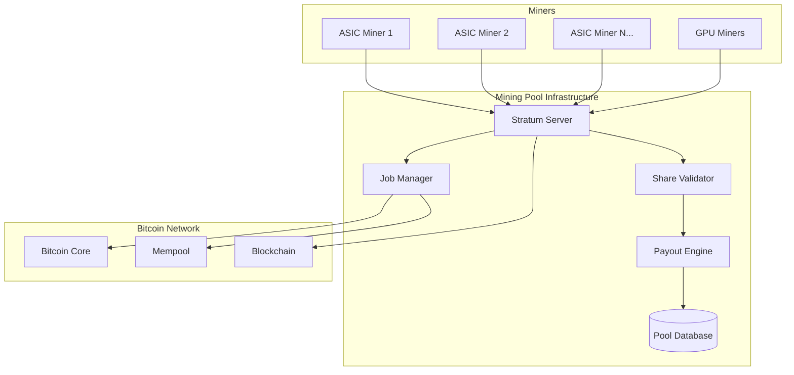

# Stratum Mining Protocol

The BLGV Mining Pool implements the Stratum protocol v1 with enterprise enhancements for high-performance Bitcoin mining operations and transparent payouts.

## ⛏️ **Protocol Overview**

### Stratum Protocol Basics
Stratum is a mining protocol that reduces bandwidth usage and provides more efficient communication between miners and pools through a JSON-RPC based protocol.



### BLGV Stratum Features
- **High Performance**: Handles 10,000+ concurrent connections
- **Vardiff**: Variable difficulty adjustment for optimal performance
- **Multi-Algorithm**: SHA-256, with future support for other algorithms
- **Real-time Monitoring**: Live stats and monitoring dashboard
- **Transparent Payouts**: Automated BLGV treasury integration

## 🔧 **Protocol Implementation**

### Server Configuration
```python
# Stratum server configuration
STRATUM_CONFIG = {
    'host': '0.0.0.0',
    'port': 3333,
    'max_connections': 10000,
    'connection_timeout': 300,
    'share_timeout': 30,
    'vardiff': {
        'enabled': True,
        'min_difficulty': 1,
        'max_difficulty': 65536,
        'retarget_time': 90,
        'variance_percent': 30
    },
    'pool_fee': 2.0,  # 2% pool fee
    'payout_threshold': 0.001,  # 0.001 BTC minimum
    'difficulty_algorithm': 'DGW'  # Dark Gravity Wave
}
```

### Message Protocol
```python
import json
from typing import Dict, Any, Optional

class StratumMessage:
    """Base Stratum message class"""
    
    def __init__(self, id: Optional[int] = None, method: str = '', 
                 params: list = None, result: Any = None, error: Any = None):
        self.id = id
        self.method = method
        self.params = params or []
        self.result = result
        self.error = error
    
    def to_json(self) -> str:
        """Convert message to JSON string"""
        message = {'id': self.id, 'jsonrpc': '2.0'}
        
        if self.method:
            message['method'] = self.method
            message['params'] = self.params
        else:
            if self.error:
                message['error'] = self.error
            else:
                message['result'] = self.result
        
        return json.dumps(message) + '\n'
    
    @classmethod
    def from_json(cls, data: str) -> 'StratumMessage':
        """Parse JSON string to StratumMessage"""
        try:
            parsed = json.loads(data.strip())
            return cls(
                id=parsed.get('id'),
                method=parsed.get('method'),
                params=parsed.get('params', []),
                result=parsed.get('result'),
                error=parsed.get('error')
            )
        except json.JSONDecodeError as e:
            raise ValueError(f"Invalid JSON: {e}")
```

## 🔗 **Connection Management**

### Miner Authentication
```python
class MinerConnection:
    """Manages individual miner connections"""
    
    def __init__(self, socket, address):
        self.socket = socket
        self.address = address
        self.worker_name = None
        self.difficulty = 1
        self.last_activity = time.time()
        self.shares_submitted = 0
        self.shares_accepted = 0
        self.authorized = False
        
    async def handle_subscribe(self, params: list) -> dict:
        """Handle mining.subscribe method"""
        user_agent = params[0] if params else "unknown"
        session_id = self.generate_session_id()
        
        # Return subscription details
        return {
            'id': None,
            'result': [
                [
                    ["mining.set_difficulty", session_id],
                    ["mining.notify", session_id]
                ],
                session_id,  # Extra nonce 1
                4  # Extra nonce 2 size
            ],
            'error': None
        }
    
    async def handle_authorize(self, params: list) -> dict:
        """Handle mining.authorize method"""
        if len(params) < 2:
            return {'result': False, 'error': 'Invalid parameters'}
        
        username = params[0]
        password = params[1]
        
        # Validate miner credentials
        if await self.validate_miner(username, password):
            self.worker_name = username
            self.authorized = True
            await self.set_initial_difficulty()
            return {'result': True, 'error': None}
        else:
            return {'result': False, 'error': 'Invalid credentials'}
    
    async def handle_submit(self, params: list) -> dict:
        """Handle mining.submit method"""
        if not self.authorized:
            return {'result': False, 'error': 'Not authorized'}
        
        if len(params) < 5:
            return {'result': False, 'error': 'Invalid parameters'}
        
        worker_name = params[0]
        job_id = params[1]
        extra_nonce2 = params[2]
        ntime = params[3]
        nonce = params[4]
        
        # Validate and process share
        share_result = await self.process_share({
            'worker_name': worker_name,
            'job_id': job_id,
            'extra_nonce2': extra_nonce2,
            'ntime': ntime,
            'nonce': nonce,
            'difficulty': self.difficulty
        })
        
        self.shares_submitted += 1
        if share_result['valid']:
            self.shares_accepted += 1
        
        return {
            'result': share_result['valid'],
            'error': share_result.get('error')
        }
```

### Variable Difficulty
```python
class VardiffManager:
    """Manages variable difficulty for miners"""
    
    def __init__(self, config: dict):
        self.config = config
        self.target_time = config['retarget_time']
        self.variance_percent = config['variance_percent']
        self.min_difficulty = config['min_difficulty']
        self.max_difficulty = config['max_difficulty']
    
    async def calculate_new_difficulty(self, miner: MinerConnection) -> float:
        """Calculate new difficulty based on miner performance"""
        recent_shares = await self.get_recent_shares(miner, time_window=300)
        
        if len(recent_shares) < 10:
            return miner.difficulty  # Not enough data
        
        avg_time = sum(share.time_diff for share in recent_shares) / len(recent_shares)
        
        if avg_time < self.target_time * (1 - self.variance_percent / 100):
            # Miner is too fast, increase difficulty
            new_difficulty = miner.difficulty * 1.1
        elif avg_time > self.target_time * (1 + self.variance_percent / 100):
            # Miner is too slow, decrease difficulty
            new_difficulty = miner.difficulty * 0.9
        else:
            return miner.difficulty  # No change needed
        
        # Clamp to min/max values
        return max(self.min_difficulty, min(self.max_difficulty, new_difficulty))
    
    async def update_miner_difficulty(self, miner: MinerConnection):
        """Update miner difficulty if needed"""
        new_difficulty = await self.calculate_new_difficulty(miner)
        
        if abs(new_difficulty - miner.difficulty) / miner.difficulty > 0.05:  # 5% threshold
            miner.difficulty = new_difficulty
            await self.send_difficulty_update(miner, new_difficulty)
    
    async def send_difficulty_update(self, miner: MinerConnection, difficulty: float):
        """Send difficulty update to miner"""
        message = StratumMessage(
            id=None,
            method='mining.set_difficulty',
            params=[difficulty]
        )
        await miner.send_message(message)
```

## 💼 **Job Management**

### Block Template Generation
```python
class JobManager:
    """Manages mining jobs and block templates"""
    
    def __init__(self, bitcoin_rpc):
        self.bitcoin_rpc = bitcoin_rpc
        self.current_job = None
        self.job_counter = 0
        self.jobs = {}  # Store recent jobs
        
    async def create_new_job(self) -> dict:
        """Create new mining job from block template"""
        template = await self.bitcoin_rpc.getblocktemplate({
            'mode': 'template',
            'capabilities': ['coinbasetxn', 'workid', 'coinbase/append']
        })
        
        self.job_counter += 1
        job_id = f"job_{self.job_counter:08x}"
        
        job = {
            'job_id': job_id,
            'previous_hash': template['previousblockhash'],
            'coinbase1': self.build_coinbase1(template),
            'coinbase2': self.build_coinbase2(template),
            'merkle_branches': self.calculate_merkle_branches(template['transactions']),
            'version': template['version'],
            'nbits': template['bits'],
            'ntime': template['curtime'],
            'clean_jobs': True,
            'height': template['height'],
            'target': template['target']
        }
        
        self.jobs[job_id] = job
        self.current_job = job
        
        return job
    
    def build_coinbase1(self, template: dict) -> str:
        """Build first part of coinbase transaction"""
        coinbase_tx = template['coinbasetxn']
        
        # Version + input count + prev hash + prev index + script length
        coinbase1 = (
            coinbase_tx['data'][:8] +  # Version
            '01' +  # Input count
            '00' * 32 +  # Previous hash (null)
            'ffffffff' +  # Previous index
            self.get_coinbase_script_length()
        )
        
        return coinbase1
    
    def build_coinbase2(self, template: dict) -> str:
        """Build second part of coinbase transaction"""
        # Sequence + output count + outputs + locktime
        outputs = self.build_coinbase_outputs(template)
        
        coinbase2 = (
            'ffffffff' +  # Sequence
            f"{len(outputs):02x}" +  # Output count
            ''.join(outputs) +
            '00000000'  # Lock time
        )
        
        return coinbase2
    
    def build_coinbase_outputs(self, template: dict) -> list:
        """Build coinbase transaction outputs"""
        outputs = []
        
        # Pool output (miner reward - fees)
        pool_reward = template['coinbasevalue'] - int(template['coinbasevalue'] * STRATUM_CONFIG['pool_fee'] / 100)
        pool_output = self.create_output(pool_reward, self.pool_address)
        outputs.append(pool_output)
        
        # Fee output (to treasury)
        fee_amount = int(template['coinbasevalue'] * STRATUM_CONFIG['pool_fee'] / 100)
        fee_output = self.create_output(fee_amount, self.treasury_address)
        outputs.append(fee_output)
        
        return outputs
```

### Share Validation
```python
class ShareValidator:
    """Validates submitted mining shares"""
    
    def __init__(self, job_manager: JobManager):
        self.job_manager = job_manager
        
    async def validate_share(self, share_data: dict) -> dict:
        """Validate a submitted share"""
        job = self.job_manager.jobs.get(share_data['job_id'])
        if not job:
            return {'valid': False, 'error': 'Job not found'}
        
        # Reconstruct block header
        header = self.reconstruct_header(job, share_data)
        
        # Calculate hash
        header_hash = self.double_sha256(header)
        
        # Check if hash meets difficulty
        target = self.difficulty_to_target(share_data['difficulty'])
        
        if int(header_hash, 16) > int(target, 16):
            return {'valid': False, 'error': 'Share difficulty too low'}
        
        # Check if it's a block solution
        block_target = int(job['target'], 16)
        is_block = int(header_hash, 16) <= block_target
        
        if is_block:
            await self.submit_block(header, job)
        
        # Record share
        await self.record_share(share_data, header_hash, is_block)
        
        return {
            'valid': True,
            'error': None,
            'is_block': is_block,
            'hash': header_hash
        }
    
    def reconstruct_header(self, job: dict, share_data: dict) -> str:
        """Reconstruct block header from job and share data"""
        # Build coinbase transaction
        coinbase = (
            job['coinbase1'] +
            share_data['extra_nonce1'] +
            share_data['extra_nonce2'] +
            job['coinbase2']
        )
        
        # Calculate merkle root
        merkle_root = self.calculate_merkle_root(
            coinbase, 
            job['merkle_branches']
        )
        
        # Build header
        header = (
            f"{job['version']:08x}" +
            job['previous_hash'] +
            merkle_root +
            f"{int(share_data['ntime'], 16):08x}" +
            job['nbits'] +
            f"{int(share_data['nonce'], 16):08x}"
        )
        
        return header
    
    def calculate_merkle_root(self, coinbase: str, merkle_branches: list) -> str:
        """Calculate merkle root from coinbase and branches"""
        current_hash = self.double_sha256(coinbase)
        
        for branch in merkle_branches:
            combined = current_hash + branch
            current_hash = self.double_sha256(combined)
        
        return current_hash
    
    @staticmethod
    def double_sha256(data: str) -> str:
        """Calculate double SHA-256 hash"""
        import hashlib
        
        binary_data = bytes.fromhex(data)
        hash1 = hashlib.sha256(binary_data).digest()
        hash2 = hashlib.sha256(hash1).digest()
        
        return hash2.hex()
```

## 💰 **Payout System**

### Share Accounting
```python
class ShareAccounting:
    """Manages share accounting and payout calculations"""
    
    def __init__(self, database):
        self.db = database
        
    async def record_share(self, worker_name: str, difficulty: float, 
                          timestamp: int, is_block: bool = False):
        """Record a valid share"""
        await self.db.execute("""
            INSERT INTO shares (worker_name, difficulty, timestamp, is_block)
            VALUES (?, ?, ?, ?)
        """, (worker_name, difficulty, timestamp, is_block))
        
        # Update worker stats
        await self.update_worker_stats(worker_name, difficulty)
        
        if is_block:
            await self.process_block_found(worker_name, difficulty, timestamp)
    
    async def calculate_payout(self, block_reward: float, shares_window: int = 86400) -> dict:
        """Calculate payouts using PPLNS (Pay Per Last N Shares)"""
        # Get shares from last N period
        shares = await self.db.fetch_all("""
            SELECT worker_name, SUM(difficulty) as total_difficulty
            FROM shares 
            WHERE timestamp > ? AND timestamp <= ?
            GROUP BY worker_name
        """, (time.time() - shares_window, time.time()))
        
        total_difficulty = sum(share['total_difficulty'] for share in shares)
        
        if total_difficulty == 0:
            return {}
        
        # Calculate individual payouts
        payouts = {}
        pool_fee = block_reward * (STRATUM_CONFIG['pool_fee'] / 100)
        distributable_reward = block_reward - pool_fee
        
        for share in shares:
            worker_portion = share['total_difficulty'] / total_difficulty
            payout = distributable_reward * worker_portion
            
            if payout >= STRATUM_CONFIG['payout_threshold']:
                payouts[share['worker_name']] = payout
        
        return payouts
    
    async def process_automatic_payouts(self):
        """Process automatic Lightning payouts"""
        pending_payouts = await self.get_pending_payouts()
        
        for worker_name, amount in pending_payouts.items():
            try:
                # Get worker Lightning invoice or address
                payment_info = await self.get_worker_payment_info(worker_name)
                
                if payment_info['method'] == 'lightning':
                    await self.send_lightning_payout(worker_name, amount, payment_info['invoice'])
                else:
                    await self.send_onchain_payout(worker_name, amount, payment_info['address'])
                    
                await self.mark_payout_sent(worker_name, amount)
                
            except Exception as e:
                logger.error(f"Payout failed for {worker_name}: {e}")
```

### Treasury Integration
```python
class TreasuryIntegration:
    """Integrates pool with BLGV Treasury system"""
    
    def __init__(self, treasury_api_key: str):
        self.treasury_api = TreasuryAPI(treasury_api_key)
        
    async def report_block_found(self, block_hash: str, block_reward: float):
        """Report found block to treasury system"""
        await self.treasury_api.post('/pool/block-found', {
            'block_hash': block_hash,
            'reward': block_reward,
            'pool_fee': block_reward * (STRATUM_CONFIG['pool_fee'] / 100),
            'timestamp': time.time(),
            'pool_address': self.pool_address
        })
    
    async def sync_treasury_balances(self):
        """Sync pool balances with treasury"""
        pool_balance = await self.get_pool_balance()
        pending_payouts = await self.get_total_pending_payouts()
        
        await self.treasury_api.post('/pool/balance-update', {
            'total_balance': pool_balance,
            'pending_payouts': pending_payouts,
            'available_balance': pool_balance - pending_payouts,
            'timestamp': time.time()
        })
```

## 📊 **Monitoring & Statistics**

### Real-time Statistics
```python
class PoolStatistics:
    """Real-time pool statistics"""
    
    def __init__(self):
        self.active_miners = 0
        self.total_hashrate = 0
        self.shares_per_minute = 0
        self.blocks_found_24h = 0
        
    async def get_pool_stats(self) -> dict:
        """Get comprehensive pool statistics"""
        now = time.time()
        
        # Active miners (last 10 minutes)
        active_miners = await self.db.fetch_one("""
            SELECT COUNT(DISTINCT worker_name) as count
            FROM shares 
            WHERE timestamp > ?
        """, (now - 600,))
        
        # Total hashrate (last hour)
        hashrate_data = await self.db.fetch_one("""
            SELECT SUM(difficulty) * POW(2, 32) / 3600 as hashrate
            FROM shares 
            WHERE timestamp > ?
        """, (now - 3600,))
        
        # Blocks found (last 24 hours)
        blocks_24h = await self.db.fetch_one("""
            SELECT COUNT(*) as count
            FROM shares 
            WHERE timestamp > ? AND is_block = 1
        """, (now - 86400,))
        
        return {
            'active_miners': active_miners['count'],
            'hashrate': hashrate_data['hashrate'] or 0,
            'shares_per_minute': await self.calculate_shares_per_minute(),
            'blocks_found_24h': blocks_24h['count'],
            'pool_fee': STRATUM_CONFIG['pool_fee'],
            'network_difficulty': await self.get_network_difficulty(),
            'next_block_eta': await self.estimate_next_block()
        }
    
    async def get_miner_stats(self, worker_name: str) -> dict:
        """Get individual miner statistics"""
        now = time.time()
        
        # Miner hashrate (last hour)
        miner_hashrate = await self.db.fetch_one("""
            SELECT SUM(difficulty) * POW(2, 32) / 3600 as hashrate
            FROM shares 
            WHERE worker_name = ? AND timestamp > ?
        """, (worker_name, now - 3600))
        
        # Miner efficiency (last 24 hours)
        efficiency_data = await self.db.fetch_one("""
            SELECT 
                COUNT(*) as total_shares,
                SUM(CASE WHEN is_block = 1 THEN 1 ELSE 0 END) as blocks_found
            FROM shares 
            WHERE worker_name = ? AND timestamp > ?
        """, (worker_name, now - 86400))
        
        return {
            'worker_name': worker_name,
            'hashrate': miner_hashrate['hashrate'] or 0,
            'shares_24h': efficiency_data['total_shares'],
            'blocks_found': efficiency_data['blocks_found'],
            'last_share': await self.get_last_share_time(worker_name),
            'estimated_earnings': await self.estimate_earnings(worker_name)
        }
```

## 🔒 **Security & Performance**

### DDoS Protection
```python
class ConnectionLimiter:
    """Rate limiting and DDoS protection"""
    
    def __init__(self):
        self.connections_per_ip = {}
        self.share_rates = {}
        
    async def check_connection_limit(self, ip_address: str) -> bool:
        """Check if IP has too many connections"""
        current_connections = self.connections_per_ip.get(ip_address, 0)
        return current_connections < 10  # Max 10 connections per IP
    
    async def check_share_rate(self, worker_name: str) -> bool:
        """Check if worker is submitting shares too fast"""
        now = time.time()
        
        if worker_name not in self.share_rates:
            self.share_rates[worker_name] = []
        
        # Remove old timestamps
        self.share_rates[worker_name] = [
            timestamp for timestamp in self.share_rates[worker_name]
            if now - timestamp < 60  # Last minute
        ]
        
        # Check rate (max 60 shares per minute)
        return len(self.share_rates[worker_name]) < 60
```

### Performance Optimization
```python
class PerformanceOptimizer:
    """Pool performance optimization"""
    
    @staticmethod
    async def optimize_database():
        """Optimize database for high-frequency operations"""
        # Create indexes for common queries
        await db.execute("CREATE INDEX IF NOT EXISTS idx_shares_worker_time ON shares(worker_name, timestamp)")
        await db.execute("CREATE INDEX IF NOT EXISTS idx_shares_time ON shares(timestamp)")
        await db.execute("CREATE INDEX IF NOT EXISTS idx_shares_block ON shares(is_block, timestamp)")
        
        # Partition old data
        await db.execute("""
            DELETE FROM shares 
            WHERE timestamp < ? AND is_block = 0
        """, (time.time() - 7776000,))  # Keep 90 days of regular shares
    
    @staticmethod
    def enable_connection_pooling():
        """Enable connection pooling for better performance"""
        pool_config = {
            'max_connections': 100,
            'min_connections': 10,
            'connection_timeout': 30,
            'idle_timeout': 300
        }
        return pool_config
```

## 📚 **Resources**

- [Stratum Protocol Specification](https://en.bitcoin.it/wiki/Stratum_mining_protocol)
- [Bitcoin Mining Reference](https://en.bitcoin.it/wiki/Mining)
- [BLGV Pool Setup Guide](../guides/pool-setup.md)
- [Mining Best Practices](../guides/mining-best-practices.md)

---

**Need help?** Check our [Mining Pool Guide](../platforms/pool.md) or reach out via [GitHub Issues](https://github.com/BlockSavvy/Unified-Treasury-System/issues). 