# 🚀 Quick Start Guide

Get up and running with the BLGV Bitcoin-native ecosystem in under 5 minutes.

## 🎯 **What is BLGV?**

BLGV (Belgravia Hartford) is a comprehensive Bitcoin-native financial infrastructure platform featuring:

- **🏛️ Treasury Intelligence** - Professional Bitcoin treasury management
- **⚡ Decentralized Exchange** - Advanced Bitcoin trading with Lightning & Taproot Assets  
- **⛏️ Mining Pool** - Mission 1867 sustainable mining operations
- **⚡ Lightning LSP** - Enterprise Lightning Network services
- **📱 Mobile App** - Unified cross-platform interface

---

## 🏗️ **Architecture Overview**

```mermaid
graph TB
    Mobile[📱 Mobile App] --> API[🔌 Unified API]
    Treasury[🏛️ Treasury] --> API
    DEX[⚡ DEX] --> API
    Pool[⛏️ Pool] --> API
    LSP[⚡ LSP] --> API
    
    API --> DB[(🗄️ PostgreSQL)]
    API --> BTC[₿ Bitcoin Network]
    API --> LN[⚡ Lightning Network]
    
    DB --> Schema1[treasury schema]
    DB --> Schema2[dex schema]
    DB --> Schema3[pool schema]
    DB --> Schema4[shared schema]
```



---

## ⚡ **Quick Setup Options**

### Option 1: Regtest Development Environment
```bash
# Clone the repository
git clone https://github.com/BlockSavvy/Unified-Treasury-System.git
cd Unified-Treasury-System

# Start regtest environment (13 Docker containers)
./regtest-ecosystem/start-regtest.sh

# Environment will be available at:
# - Treasury: http://localhost:3001
# - DEX: http://localhost:3002  
# - Pool: http://localhost:3003
# - Unified API: http://localhost:3004
```

### Option 2: Production Environment Access
```bash
# Production platforms:
# - Treasury: https://blgvbtc.com
# - DEX: https://dex.blgvbtc.com
# - Pool: https://pool.blgvbtc.com
# - API: https://api.blgvbtc.com
```

### Option 3: Mobile App Development
```bash
# Navigate to mobile app
cd platforms/blgv-wallet-app

# Install dependencies
npm install

# Start development server
npx expo start

# Scan QR code with Expo Go app
```

---

## 🔧 **Platform-Specific Quick Starts**

### Treasury Platform
1. **Access**: [blgvbtc.com](https://blgvbtc.com)
2. **Features**: BTC-per-share tracking, financial reporting, treasury analytics
3. **Documentation**: [Treasury Guide](/platforms/treasury)

### DEX Platform  
1. **Access**: [dex.blgvbtc.com](https://dex.blgvbtc.com)
2. **Features**: Bitcoin trading, Lightning integration, Taproot Assets
3. **Documentation**: [DEX Guide](/platforms/dex)

### Mining Pool
1. **Access**: [pool.blgvbtc.com](https://pool.blgvbtc.com) 
2. **Features**: Mission 1867 sustainable mining, Stratum protocols
3. **Documentation**: [Pool Guide](/platforms/pool)

### Lightning LSP
1. **Features**: Channel management, liquidity provision, enterprise services
2. **Documentation**: [LSP Guide](/platforms/lsp)

### Mobile App
1. **Features**: Unified ecosystem access, biometric security, real-time sync
2. **Documentation**: [Mobile Guide](/platforms/mobile)

---

## 🛠️ **SDK Integration**

### TypeScript/JavaScript
```typescript
import { MobileSDK } from '@blgv/ecosystem-sdk/mobile';

const sdk = new MobileSDK({
  environment: 'production', // or 'regtest'
  apiKey: 'your-api-key'
});

await sdk.initialize();

// Access treasury data
const treasury = await sdk.treasury.getTreasuryData();

// Access DEX markets  
const markets = await sdk.dex.getMarkets();

// Access pool statistics
const poolStats = await sdk.pool.getPoolStats();
```

### iOS (Swift)
```swift
import BLGVEcosystemSDK

let sdk = BLGVEcosystemSDK(
    environment: .production,
    apiKey: "your-api-key"
)

sdk.initialize { result in
    switch result {
    case .success:
        // SDK ready to use
    case .failure(let error):
        print("SDK initialization failed: \(error)")
    }
}
```

---

## 🔐 **Environment Configuration**

### Development (.env.development)
```bash
EXPO_PUBLIC_ENVIRONMENT=development
EXPO_PUBLIC_API_BASE_URL=http://localhost:3004
EXPO_PUBLIC_TEST_MODE=true
```

### Regtest (.env.regtest)  
```bash
EXPO_PUBLIC_ENVIRONMENT=regtest
EXPO_PUBLIC_API_BASE_URL=http://10.0.0.45:3004
EXPO_PUBLIC_REGTEST_FAUCET_ENABLED=true
```

### Production (.env.production)
```bash
EXPO_PUBLIC_ENVIRONMENT=production
EXPO_PUBLIC_API_BASE_URL=https://api.blgvbtc.com
EXPO_PUBLIC_TEST_MODE=false
```

**💡 See [Environment Secrets](/ENVIRONMENT_SECRETS) for complete configuration.**

---

## 🚀 **Deployment**

### One-Command Deployment
```bash
# Deploy all platforms to Digital Ocean
./ops/deploy/sync-to-production.sh --all

# Deploy specific platform
./ops/deploy/sync-to-production.sh --platform treasury
```

**📖 See [Deployment Guide](/deployment/DEPLOYMENT) for detailed instructions.**

---

## 📚 **Next Steps**

1. **📖 Read Platform Guides**: [Treasury](/platforms/treasury) | [DEX](/platforms/dex) | [Pool](/platforms/pool) | [LSP](/platforms/lsp) | [Mobile](/platforms/mobile)

2. **🔧 SDK Documentation**: [Unified SDK Guide](/sdk/README)

3. **🔐 Security Setup**: [Security Overview](/security/overview)

4. **🤖 AI Development**: [Modern AI Workflow](/ai-development/MODERN_AI_WORKFLOW)

5. **💬 Get Help**: 
   - **Discord**: [BLGV Community](https://discord.gg/blgv)
   - **Support**: [support@blgvbtc.com](mailto:support@blgvbtc.com)
   - **Documentation**: [docs.blgvbtc.com](https://docs.blgvbtc.com)

---

## ⚠️ **Important Notes**

### 🚫 No Hardcoded Data
- **Always** use regtest environment for development data
- **Never** use mock/sample data in any code
- **Production** data comes from live APIs and databases

### ₿ Bitcoin-First Principles  
- Everything centers around Bitcoin (no altcoins)
- BTC-per-share growth is the primary success metric
- Mobile-first, professional, enterprise-grade approach

### 🔄 Real-Time Sync
- WebSocket-driven live updates across all platforms
- Cross-platform synchronization via unified SDK
- Event-driven architecture for instant updates

---

**🎉 Welcome to the BLGV ecosystem! You're now ready to build the future of Bitcoin-native finance.** 