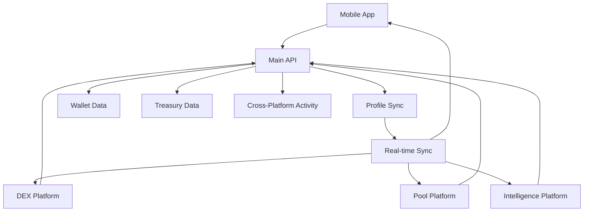

# BLGV Ecosystem SDK

The **BLGV Ecosystem SDK** is a comprehensive TypeScript SDK for seamless integration across all BLGV platforms:

- 📱 **Mobile App** (iOS/Android via React Native)
- 🌐 **DEX Platform** (Web)
- ⛏️ **Mining Pool** (Web)
- 🧠 **Treasury Intelligence** (Web/API)

## 🚀 Quick Start

### Mobile (React Native/Expo)

```typescript
import { MobileSDK } from '@blgv/ecosystem-sdk';

const sdk = new MobileSDK({
  environment: 'production',
  apiKey: 'your-api-key', // Optional
});

await sdk.initialize();

// Access modules
const treasuryData = await sdk.treasury.getTreasuryData();
const userProfile = await sdk.profile.createProfile({
  walletAddress: 'bc1...',
  platform: 'mobile'
});
```

### Web (Browser)

```typescript
import { WebSDK } from '@blgv/ecosystem-sdk';

const sdk = new WebSDK({
  environment: 'production',
  apiKey: 'your-api-key',
});

await sdk.initialize();

// Connect web wallet
const walletAddress = await sdk.connectWebWallet();
if (walletAddress) {
  await sdk.auth.authenticateWithWallet(walletAddress, signature);
}
```

### API (Server-side)

```typescript
import { APIClientSDK } from '@blgv/ecosystem-sdk';

const sdk = new APIClientSDK({
  environment: 'production',
  apiKey: 'your-server-api-key', // Required
});

await sdk.initialize();

// Bulk operations
const results = await sdk.processBatch(
  userIds,
  async (userId) => sdk.profile.getUserProfile(userId)
);
```

## 🏗️ Architecture

### Core Modules

- **🔐 AuthSDK** - Authentication & session management
- **👤 ProfileSDK** - User profiles & cross-platform sync
- **💰 WalletSDK** - Bitcoin wallet operations
- **🏦 TreasurySDK** - Treasury data & analytics
- **🔄 DEXSDK** - Trading & market data
- **⛏️ PoolSDK** - Mining pool operations
- **🔄 SyncSDK** - Cross-platform synchronization

### Platform Adapters

- **MobileSDK** - React Native optimizations
- **WebSDK** - Browser-specific features
- **APIClientSDK** - Server-side utilities

## 📊 Data Flow



## 🔄 Cross-Platform Sync

The SDK automatically synchronizes user data across all platforms:

```typescript
// On mobile app
await sdk.wallet.createWallet({ type: 'p2tr' });

// Automatically syncs to web platforms
// User can access same wallet on DEX, Pool, etc.

// Real-time activity tracking
sdk.sync.on('dexActivity', (activity) => {
  console.log('User traded on DEX:', activity);
});

sdk.sync.on('miningActivity', (activity) => {
  console.log('Mining payout received:', activity);
});
```

## 🛡️ Authentication

### Wallet-based Authentication

```typescript
// Sign message with wallet
const signature = await signMessage(walletAddress, challengeMessage);

// Authenticate
const session = await sdk.auth.authenticateWithWallet(walletAddress, signature);

if (session.isAuthenticated) {
  // Access protected resources
  const profile = await sdk.profile.getCurrentProfile();
}
```

### API Key Authentication

```typescript
// For server-side access
const session = await sdk.auth.authenticateWithAPIKey(apiKey);
```

## 💼 Profile Management

```typescript
// Create comprehensive user profile
const profile = await sdk.profile.createProfile({
  walletAddress: 'bc1...',
  platform: 'mobile',
  preferences: {
    currency: 'BTC',
    theme: 'dark',
    notifications: {
      treasury: true,
      mining: true,
      dex: true,
      price: true
    }
  }
});

// Add additional wallets
await sdk.profile.addWalletAddress('bc1...');

// Update verification status
await sdk.profile.updateVerificationStatus({
  equityVerified: true,
  schwabConnected: true
});
```

## 🏦 Treasury Integration

```typescript
// Get live treasury data
const treasury = await sdk.treasury.getTreasuryData();
console.log(`BTC Holdings: ${treasury.btcBalance}`);
console.log(`NAV: ${treasury.btcNAV}`);
console.log(`Premium/Discount: ${treasury.premiumDiscount}%`);

// Subscribe to real-time updates
sdk.treasury.on('dataUpdated', (data) => {
  updateUI(data);
});
```

## 💱 DEX Integration

```typescript
// Get market data
const markets = await sdk.dex.getMarkets();

// Place order
const order = await sdk.dex.placeOrder({
  marketId: 'BTC-USD',
  side: 'buy',
  type: 'limit',
  amount: 0.1,
  price: 45000,
  walletAddress: userWallet
});

// Track order status
sdk.dex.on('orderFilled', (order) => {
  notifyUser(`Order ${order.id} filled!`);
});
```

## ⛏️ Mining Pool Integration

```typescript
// Get pool statistics
const poolStats = await sdk.pool.getPoolStats();

// Add miner
const miner = await sdk.pool.addMiner({
  name: 'Antminer S19',
  type: 'asic',
  walletAddress: payoutWallet,
  expectedHashrate: 95000000000000 // 95 TH/s
});

// Get earnings
const earnings = await sdk.pool.getTotalEarnings(walletAddress);
```

## 🔄 Real-time Synchronization

```typescript
// Enable automatic sync
await sdk.sync.enableAutoSync();

// Queue operations for sync
await sdk.sync.queueOperation({
  type: 'create',
  entity: 'wallet',
  data: walletData,
  platform: 'mobile'
});

// Handle conflicts
sdk.sync.on('conflictsDetected', async (conflicts) => {
  for (const conflict of conflicts) {
    await sdk.sync.resolveConflict(conflict.id, 'latest');
  }
});

// Monitor sync status
sdk.sync.on('syncCompleted', (status) => {
  console.log('Sync completed:', status);
});
```

## 🔧 Configuration

### Environment Configuration

```typescript
// Development
const devConfig = {
  environment: 'development',
  customEndpoints: {
    main: 'http://localhost:3000/api',
    dex: 'http://localhost:3001/api',
    pool: 'http://localhost:3002/api',
    treasury: 'http://localhost:3003/api'
  }
};

// Production
const prodConfig = {
  environment: 'production',
  apiKey: process.env.BLGV_API_KEY
};
```

### Advanced Configuration

```typescript
const sdk = new MobileSDK({
  environment: 'production',
  apiKey: 'your-key',
  overrides: {
    timeout: 60000,
    retryAttempts: 5,
    enableSync: true,
    enableAnalytics: true,
    debugMode: false
  }
});
```

## 📱 Platform-Specific Features

### Mobile Features

```typescript
// Push notifications
await sdk.enablePushNotifications();

// Biometric authentication
await sdk.enableBiometricAuth();

// Background sync
sdk.sync.on('networkStatusChanged', ({ isOnline }) => {
  if (isOnline) {
    sdk.sync.syncNow();
  }
});
```

### Web Features

```typescript
// Web wallet integration
const walletAddress = await sdk.connectWebWallet();

// Share functionality
await sdk.shareData({
  title: 'BLGV Treasury',
  text: 'Check out the BLGV Bitcoin Treasury',
  url: 'https://blgvbtc.com'
});

// Desktop notifications
await sdk.enableWebNotifications();
```

### Server Features

```typescript
// Bulk processing
const results = await sdk.processBatch(
  largeDataSet,
  async (item) => processItem(item),
  50 // batch size
);

// Rate limiting
const result = await sdk.withRateLimit(
  () => apiCall(),
  1000 // 1 second delay
);

// Health monitoring
const health = await sdk.healthCheck();
```

## 🎯 Event System

```typescript
// SDK-wide events
sdk.on('initialized', () => console.log('SDK ready'));
sdk.on('error', (error) => handleError(error));

// Module-specific events
sdk.wallet.on('transactionSent', ({ txid }) => {
  showNotification(`Transaction sent: ${txid}`);
});

sdk.treasury.on('dataUpdated', (data) => {
  updateDashboard(data);
});

sdk.auth.on('logout', () => {
  redirectToLogin();
});
```

## 🧪 Testing

```typescript
// Mock SDK for testing
import { createMockSDK } from '@blgv/ecosystem-sdk/testing';

const mockSdk = createMockSDK({
  treasury: {
    btcBalance: 847.5,
    btcPrice: 45000,
    premiumDiscount: 2.5
  }
});

// Use in tests
expect(await mockSdk.treasury.getTreasuryData()).toEqual({
  btcBalance: 847.5,
  // ...
});
```

## 🚀 Deployment

### Environment Variables

```bash
# Required
BLGV_API_KEY=your_api_key_here
BLGV_ENVIRONMENT=production

# Optional
BLGV_DEBUG_MODE=false
BLGV_ENABLE_SYNC=true
BLGV_ENABLE_ANALYTICS=true
```

### Package Installation

```bash
npm install @blgv/ecosystem-sdk
# or
yarn add @blgv/ecosystem-sdk
```

## 📈 Performance

- **Optimized API calls** with automatic batching
- **Intelligent caching** with cache invalidation
- **Background sync** with conflict resolution
- **Platform-specific optimizations**
- **Automatic retry** with exponential backoff

## 🔒 Security

- **Wallet-based authentication**
- **Secure local storage** (Keychain/SecureStore)
- **API key management**
- **Request signing**
- **Rate limiting**
- **Input validation**

## 🆘 Support

For issues, questions, or contributions:

- 📧 Email: dev@blgvbtc.com
- 🐛 Issues: GitHub Issues
- 📖 Docs: [docs.blgvbtc.com/sdk](https://docs.blgvbtc.com/sdk)

## 📄 License

MIT License - see LICENSE file for details.

---

**Built with ❤️ for the BLGV Bitcoin Treasury Ecosystem**