# 🔐 Security Overview

Enterprise-grade security for the BLGV Bitcoin-native ecosystem.

## 🎯 **Security Philosophy**

### Bitcoin-Native Security
- **Proof-of-Reserves** - Real-time, verifiable Bitcoin holdings
- **Multi-Signature Wallets** - No single point of failure
- **Hardware Security Modules** - Keys never touch hot storage
- **Zero-Trust Architecture** - Every request verified

### Defense in Depth

```mermaid
graph TB
    User[👤 User] --> WAF[🛡️ Web Application Firewall]
    WAF --> LB[⚖️ Load Balancer]
    LB --> Auth[🔐 Authentication Layer]
    Auth --> API[🔌 API Gateway]
    API --> App[📱 Application]
    App --> DB[(🗄️ Encrypted Database)]
    App --> BTC[₿ Bitcoin Network]
```


## 🔑 **Authentication & Authorization**

### Multi-Factor Authentication
```typescript
interface AuthFactors {
  password: string;           // Something you know
  biometric: BiometricData;   // Something you are  
  walletSignature: string;    // Something you own (Bitcoin wallet)
  deviceToken: string;        // Trusted device
}

const authenticateUser = async (factors: AuthFactors) => {
  // Verify all factors before granting access
  const results = await Promise.all([
    verifyPassword(factors.password),
    verifyBiometric(factors.biometric),
    verifyWalletSignature(factors.walletSignature),
    verifyDevice(factors.deviceToken)
  ]);
  
  return results.every(result => result.valid);
};
```

### Role-Based Access Control (RBAC)
```typescript
enum UserRole {
  VIEWER = 'viewer',
  TRADER = 'trader', 
  ADMIN = 'admin',
  TREASURY = 'treasury'
}

const permissions = {
  [UserRole.VIEWER]: ['read:dashboard', 'read:analytics'],
  [UserRole.TRADER]: ['read:markets', 'write:orders'],
  [UserRole.ADMIN]: ['read:*', 'write:users', 'write:settings'],
  [UserRole.TREASURY]: ['read:*', 'write:treasury', 'sign:transactions']
};
```

## 🛡️ **API Security**

### Rate Limiting
```typescript
const rateLimiter = rateLimit({
  windowMs: 15 * 60 * 1000, // 15 minutes
  max: 100, // Limit each IP to 100 requests per windowMs
  message: 'Too many requests from this IP',
  standardHeaders: true,
  legacyHeaders: false,
});

// Stricter limits for sensitive endpoints
const sensitiveRateLimit = rateLimit({
  windowMs: 60 * 1000, // 1 minute
  max: 5, // 5 requests per minute
  skipSuccessfulRequests: true,
});
```

### Request Validation
```typescript
import { z } from 'zod';

const TransactionSchema = z.object({
  amount: z.number().positive().max(1000000), // Max 1M sats
  recipient: z.string().regex(/^[a-zA-Z0-9]{26,35}$/), // Bitcoin address
  memo: z.string().max(100).optional(),
});

const validateTransaction = (req: Request, res: Response, next: NextFunction) => {
  try {
    TransactionSchema.parse(req.body);
    next();
  } catch (error) {
    res.status(400).json({ error: 'Invalid transaction data' });
  }
};
```

### HMAC Signature Verification
```typescript
const verifyHMAC = (req: Request, res: Response, next: NextFunction) => {
  const signature = req.headers['x-blgv-signature'] as string;
  const payload = JSON.stringify(req.body);
  const secret = process.env.HMAC_SECRET!;
  
  const expectedSignature = crypto
    .createHmac('sha256', secret)
    .update(payload)
    .digest('hex');
    
  if (!crypto.timingSafeEqual(
    Buffer.from(signature, 'hex'),
    Buffer.from(expectedSignature, 'hex')
  )) {
    return res.status(401).json({ error: 'Invalid signature' });
  }
  
  next();
};
```

## 💾 **Data Protection**

### Encryption at Rest
```typescript
// Database encryption
const encryptedFields = {
  privateKey: {
    type: DataTypes.TEXT,
    get() {
      const encrypted = this.getDataValue('privateKey');
      return encrypted ? decrypt(encrypted) : null;
    },
    set(value: string) {
      this.setDataValue('privateKey', encrypt(value));
    }
  }
};

// File encryption
const encryptFile = (data: Buffer, key: string): Buffer => {
  const cipher = crypto.createCipher('aes-256-gcm', key);
  return Buffer.concat([cipher.update(data), cipher.final()]);
};
```

### Encryption in Transit
```typescript
// TLS 1.3 configuration
const tlsOptions = {
  minVersion: 'TLSv1.3',
  ciphers: [
    'TLS_AES_256_GCM_SHA384',
    'TLS_CHACHA20_POLY1305_SHA256',
    'TLS_AES_128_GCM_SHA256'
  ].join(':'),
  honorCipherOrder: true,
  secureProtocol: 'TLSv1_3_method'
};
```

## ₿ **Bitcoin Security**

### Multi-Signature Wallets
```typescript
interface MultiSigWallet {
  requiredSignatures: number; // e.g., 3
  totalSigners: number;       // e.g., 5
  signers: PublicKey[];
  policy: SigningPolicy;
}

const createMultiSigTransaction = async (
  wallet: MultiSigWallet,
  transaction: Transaction
) => {
  // Require multiple signatures for treasury transactions
  const signatures = await collectSignatures(wallet.signers, transaction);
  
  if (signatures.length < wallet.requiredSignatures) {
    throw new Error('Insufficient signatures');
  }
  
  return finalizeTransaction(transaction, signatures);
};
```

### Hardware Security Modules (HSM)
```typescript
class HSMManager {
  private hsm: HSMClient;
  
  async signTransaction(transaction: Transaction): Promise<Signature> {
    // Keys never leave the HSM
    return await this.hsm.sign({
      data: transaction.hash(),
      keyId: 'treasury-signing-key',
      algorithm: 'ECDSA-SHA256'
    });
  }
  
  async generateKey(): Promise<string> {
    return await this.hsm.generateKey({
      algorithm: 'secp256k1',
      extractable: false // Key cannot be exported
    });
  }
}
```

## 🔍 **Monitoring & Incident Response**

### Security Event Logging
```typescript
enum SecurityEvent {
  LOGIN_ATTEMPT = 'login_attempt',
  LOGIN_SUCCESS = 'login_success', 
  LOGIN_FAILURE = 'login_failure',
  SUSPICIOUS_ACTIVITY = 'suspicious_activity',
  API_RATE_LIMIT = 'api_rate_limit',
  TRANSACTION_SIGNED = 'transaction_signed'
}

const logSecurityEvent = (event: SecurityEvent, data: any) => {
  const logEntry = {
    timestamp: new Date().toISOString(),
    event,
    data,
    userAgent: data.userAgent,
    ipAddress: data.ipAddress,
    userId: data.userId
  };
  
  // Send to security monitoring system
  securityLogger.warn(logEntry);
  
  // Alert on critical events
  if (event === SecurityEvent.SUSPICIOUS_ACTIVITY) {
    alertSecurityTeam(logEntry);
  }
};
```

### Anomaly Detection
```typescript
const detectAnomalies = async (userId: string, action: string) => {
  const userBehavior = await getUserBehaviorProfile(userId);
  const currentBehavior = {
    timeOfDay: new Date().getHours(),
    location: await getLocationFromIP(),
    device: getDeviceFingerprint(),
    action
  };
  
  const riskScore = calculateRiskScore(userBehavior, currentBehavior);
  
  if (riskScore > RISK_THRESHOLD) {
    await triggerAdditionalVerification(userId);
    logSecurityEvent(SecurityEvent.SUSPICIOUS_ACTIVITY, {
      userId,
      riskScore,
      action
    });
  }
};
```

## 🚨 **Incident Response**

### Automated Response
```typescript
const incidentResponse = {
  [ThreatLevel.LOW]: {
    actions: ['log', 'monitor'],
    escalation: false
  },
  [ThreatLevel.MEDIUM]: {
    actions: ['log', 'rate_limit', 'notify_team'],
    escalation: true
  },
  [ThreatLevel.HIGH]: {
    actions: ['log', 'block_ip', 'lock_account', 'alert_security'],
    escalation: true
  },
  [ThreatLevel.CRITICAL]: {
    actions: ['emergency_lockdown', 'freeze_transactions', 'contact_authorities'],
    escalation: true
  }
};
```

### Emergency Procedures
```typescript
class EmergencyLockdown {
  async initiate(reason: string, triggeredBy: string) {
    // 1. Stop all trading
    await tradingEngine.halt();
    
    // 2. Freeze withdrawals
    await walletService.freezeWithdrawals();
    
    // 3. Notify all users
    await notificationService.broadcastEmergency(
      'System temporarily unavailable for security reasons'
    );
    
    // 4. Alert security team
    await alertSecurityTeam({
      event: 'EMERGENCY_LOCKDOWN',
      reason,
      triggeredBy,
      timestamp: new Date().toISOString()
    });
  }
}
```

## 🔒 **Security Best Practices**

### Development Security
- **Code Review** - All code reviewed by security team
- **SAST/DAST** - Static and dynamic security testing
- **Dependency Scanning** - Monitor for vulnerable packages
- **Secrets Management** - Never commit secrets to git

### Infrastructure Security
- **Zero-Trust Network** - All network traffic encrypted and authenticated
- **Container Security** - Minimal, hardened container images
- **Regular Updates** - Automated security patches
- **Backup Encryption** - All backups encrypted at rest

### Operational Security
- **Principle of Least Privilege** - Minimum required access
- **Separation of Duties** - No single person can execute high-risk actions
- **Regular Audits** - Internal and external security audits
- **Security Training** - Regular team security awareness training

## 📊 **Security Metrics**

### Key Performance Indicators
- **Mean Time to Detection (MTTD)** - < 5 minutes
- **Mean Time to Response (MTTR)** - < 15 minutes  
- **False Positive Rate** - < 5%
- **Security Event Volume** - Baseline established

### Compliance Standards
- **SOC 2 Type II** - Security controls audit
- **ISO 27001** - Information security management
- **PCI DSS** - Payment card industry compliance
- **GDPR** - Data protection regulation compliance 